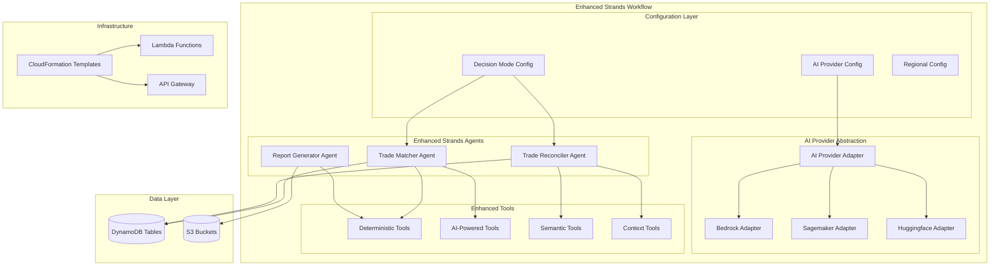

# Design Document

## Overview

This design enhances the existing AI OTC Trade Reconciliation Solution built with the Strands agents SDK to support configurable AI model providers, intelligent decision-making approaches, and improved scalability. The solution maintains the existing three-agent workflow (trade_matcher, trade_reconciler, report_generator) while adding AI-powered capabilities and flexible deployment options.

The enhanced system will support both deterministic rule-based matching and LLM-based intelligent matching, with configurable AI providers (AWS Bedrock, Sagemaker AI Jumpstart, or Huggingface models) to accommodate different regional and organizational requirements.

## Architecture

### High-Level Architecture



### Component Architecture

The enhanced system follows a layered architecture:

1. **Configuration Layer**: Manages AI provider selection and decision-making modes
2. **AI Provider Abstraction Layer**: Provides unified interface for different AI services
3. **Enhanced Strands Agents Layer**: Extended agents with AI capabilities
4. **Enhanced Tools Layer**: Mix of deterministic and AI-powered tools
5. **Data Layer**: Existing DynamoDB and S3 infrastructure
6. **Infrastructure Layer**: Updated CloudFormation templates

## Components and Interfaces

### 1. AI Provider Abstraction Layer

#### AIProviderAdapter Interface
```python
from abc import ABC, abstractmethod
from typing import Dict, Any, List, Optional

class AIProviderAdapter(ABC):
    """Abstract base class for AI provider adapters"""
    
    @abstractmethod
    async def initialize(self, config: Dict[str, Any]) -> bool:
        """Initialize the AI provider with configuration"""
        pass
    
    @abstractmethod
    async def analyze_document_context(self, document_data: Dict[str, Any]) -> Dict[str, Any]:
        """Analyze document to understand context and extract relevant fields"""
        pass
    
    @abstractmethod
    async def semantic_field_matching(self, field1: str, field2: str, context: str) -> float:
        """Calculate semantic similarity between field names"""
        pass
    
    @abstractmethod
    async def intelligent_trade_matching(self, trade1: Dict[str, Any], trade2: Dict[str, Any]) -> Dict[str, Any]:
        """Perform intelligent trade matching using AI"""
        pass
    
    @abstractmethod
    async def explain_mismatch(self, field_name: str, value1: Any, value2: Any, context: str) -> str:
        """Generate human-readable explanation for field mismatches"""
        pass
```

#### BedrockAdapter Implementation
```python
import boto3
from botocore.exceptions import ClientError

class BedrockAdapter(AIProviderAdapter):
    """AWS Bedrock implementation of AI provider adapter"""
    
    def __init__(self):
        self.client = None
        self.model_id = None
        self.region = None
    
    async def initialize(self, config: Dict[str, Any]) -> bool:
        try:
            self.region = config.get('region', 'us-east-1')
            self.model_id = config.get('model_id', 'anthropic.claude-3-sonnet-20240229-v1:0')
            self.client = boto3.client('bedrock-runtime', region_name=self.region)
            return True
        except Exception as e:
            logger.error(f"Failed to initialize Bedrock: {e}")
            return False
    
    async def analyze_document_context(self, document_data: Dict[str, Any]) -> Dict[str, Any]:
        prompt = f"""
        Analyze this trade document and identify:
        1. Transaction type (e.g., commodity swap, forward, option)
        2. Critical fields for reconciliation
        3. Field mappings and semantic equivalents
        
        Document data: {json.dumps(document_data, indent=2)}
        
        Return JSON with: transaction_type, critical_fields, field_mappings
        """
        
        response = await self._invoke_model(prompt)
        return json.loads(response)
```

#### SagemakerAdapter Implementation
```python
import boto3
import json

class SagemakerAdapter(AIProviderAdapter):
    """AWS Sagemaker implementation of AI provider adapter"""
    
    def __init__(self):
        self.client = None
        self.endpoint_name = None
        self.region = None
    
    async def initialize(self, config: Dict[str, Any]) -> bool:
        try:
            self.region = config.get('region', 'me-central-1')
            self.endpoint_name = config.get('endpoint_name')
            self.client = boto3.client('sagemaker-runtime', region_name=self.region)
            return True
        except Exception as e:
            logger.error(f"Failed to initialize Sagemaker: {e}")
            return False
    
    async def analyze_document_context(self, document_data: Dict[str, Any]) -> Dict[str, Any]:
        payload = {
            "inputs": f"Analyze trade document: {json.dumps(document_data)}",
            "parameters": {
                "task": "document_analysis",
                "return_format": "json"
            }
        }
        
        response = self.client.invoke_endpoint(
            EndpointName=self.endpoint_name,
            ContentType='application/json',
            Body=json.dumps(payload)
        )
        
        result = json.loads(response['Body'].read().decode())
        return result
```

### 2. Enhanced Strands Tools

#### AI-Powered Trade Analysis Tool
```python
from strands import tool
from typing import Dict, Any, List

@tool
async def ai_analyze_trade_context(
    trade_data: Dict[str, Any], 
    ai_provider: AIProviderAdapter,
    mode: str = "llm"
) -> Dict[str, Any]:
    """
    Analyze trade context using AI or deterministic rules based on mode.
    
    Args:
        trade_data: Trade information to analyze
        ai_provider: Configured AI provider adapter
        mode: "deterministic", "llm", or "hybrid"
    
    Returns:
        Dict containing transaction type, critical fields, and context
    """
    if mode == "deterministic":
        return _deterministic_trade_analysis(trade_data)
    elif mode == "llm":
        return await ai_provider.analyze_document_context(trade_data)
    elif mode == "hybrid":
        deterministic_result = _deterministic_trade_analysis(trade_data)
        ai_result = await ai_provider.analyze_document_context(trade_data)
        return _merge_analysis_results(deterministic_result, ai_result)
    else:
        raise ValueError(f"Unsupported analysis mode: {mode}")

def _deterministic_trade_analysis(trade_data: Dict[str, Any]) -> Dict[str, Any]:
    """Existing deterministic analysis logic"""
    # Implementation of current rule-based analysis
    transaction_type = "unknown"
    if trade_data.get('commodity_type'):
        transaction_type = "commodity_trade"
    elif trade_data.get('currency_pair'):
        transaction_type = "fx_trade"
    
    critical_fields = ["trade_date", "total_notional_quantity", "currency"]
    
    return {
        "transaction_type": transaction_type,
        "critical_fields": critical_fields,
        "confidence": 0.8,
        "method": "deterministic"
    }
```

#### Semantic Field Matching Tool
```python
@tool
async def semantic_field_match(
    field1_name: str,
    field1_value: Any,
    field2_name: str, 
    field2_value: Any,
    ai_provider: AIProviderAdapter,
    mode: str = "llm",
    context: str = ""
) -> Dict[str, Any]:
    """
    Compare fields using semantic understanding or exact matching.
    
    Returns:
        Dict with match_status, confidence, reasoning
    """
    if mode == "deterministic":
        return _deterministic_field_match(field1_name, field1_value, field2_name, field2_value)
    elif mode == "llm":
        semantic_score = await ai_provider.semantic_field_matching(field1_name, field2_name, context)
        
        if semantic_score > 0.9:  # High semantic similarity
            # Compare values with AI understanding
            match_result = await ai_provider.intelligent_trade_matching(
                {field1_name: field1_value}, 
                {field2_name: field2_value}
            )
            return match_result
        else:
            return {
                "match_status": "SEMANTIC_MISMATCH",
                "confidence": semantic_score,
                "reasoning": f"Field names '{field1_name}' and '{field2_name}' are not semantically equivalent"
            }
    elif mode == "hybrid":
        # Try deterministic first, fall back to AI for edge cases
        det_result = _deterministic_field_match(field1_name, field1_value, field2_name, field2_value)
        if det_result["match_status"] == "UNCERTAIN":
            return await semantic_field_match(field1_name, field1_value, field2_name, field2_value, ai_provider, "llm", context)
        return det_result
```

### 3. Enhanced Strands Agents

#### Enhanced Trade Matcher Agent
The existing trade matcher agent will be enhanced with AI capabilities:

```python
# Enhanced system prompt for trade_matcher agent
ENHANCED_TRADE_MATCHER_PROMPT = """
You are an enhanced trade matching agent with configurable AI capabilities.

Your configuration:
- AI Provider: {ai_provider_type}
- Decision Mode: {decision_mode}
- Matching Threshold: {threshold}
- Regional Settings: {region}

Enhanced Tasks:
1. Use ai_analyze_trade_context tool to understand trade types and critical fields
2. Apply semantic_field_match for intelligent field comparison when in LLM mode
3. Use existing deterministic tools when in deterministic mode
4. Combine both approaches in hybrid mode
5. Generate detailed explanations for matching decisions

When processing trades:
- First analyze context to identify transaction type and critical fields
- Apply appropriate matching strategy based on configuration
- Provide confidence scores and reasoning for all matches
- Handle regional terminology variations intelligently
"""
```

#### Enhanced Trade Reconciler Agent
```python
ENHANCED_TRADE_RECONCILER_PROMPT = """
You are an enhanced trade reconciliation agent with AI-powered field comparison.

Your configuration:
- AI Provider: {ai_provider_type}
- Decision Mode: {decision_mode}
- Critical Fields: {critical_fields}
- Tolerances: {tolerances}

Enhanced Tasks:
1. Use semantic_field_match for intelligent field-by-field comparison
2. Generate AI-powered explanations for mismatches using explain_mismatch tool
3. Adapt field comparison based on transaction type context
4. Handle non-standardized terminology in commodities trading
5. Provide structured output with detailed reasoning

Field Comparison Strategy:
- Use deterministic comparison for exact-match fields (dates, IDs)
- Use AI semantic comparison for descriptive fields (counterparty names, product descriptions)
- Apply context-aware tolerances based on transaction type
"""
```

### 4. Configuration Management

#### AI Provider Configuration
```python
from dataclasses import dataclass
from typing import Dict, Any, Optional

@dataclass
class AIProviderConfig:
    """Configuration for AI provider selection and settings"""
    provider_type: str  # "bedrock", "sagemaker", "huggingface"
    region: str
    model_config: Dict[str, Any]
    fallback_provider: Optional[str] = None
    
    @classmethod
    def from_environment(cls) -> 'AIProviderConfig':
        """Load configuration from environment variables"""
        provider_type = os.getenv('AI_PROVIDER_TYPE', 'bedrock')
        region = os.getenv('AI_PROVIDER_REGION', 'us-east-1')
        
        model_config = {}
        if provider_type == 'bedrock':
            model_config = {
                'model_id': os.getenv('BEDROCK_MODEL_ID', 'anthropic.claude-3-sonnet-20240229-v1:0'),
                'max_tokens': int(os.getenv('BEDROCK_MAX_TOKENS', '4096'))
            }
        elif provider_type == 'sagemaker':
            model_config = {
                'endpoint_name': os.getenv('SAGEMAKER_ENDPOINT_NAME'),
                'instance_type': os.getenv('SAGEMAKER_INSTANCE_TYPE', 'ml.m5.large')
            }
        elif provider_type == 'huggingface':
            model_config = {
                'model_name': os.getenv('HUGGINGFACE_MODEL_NAME', 'microsoft/DialoGPT-medium'),
                'api_token': os.getenv('HUGGINGFACE_API_TOKEN')
            }
        
        return cls(
            provider_type=provider_type,
            region=region,
            model_config=model_config,
            fallback_provider=os.getenv('AI_FALLBACK_PROVIDER')
        )

@dataclass
class DecisionModeConfig:
    """Configuration for decision-making approach"""
    mode: str  # "deterministic", "llm", "hybrid"
    confidence_threshold: float = 0.8
    hybrid_fallback_threshold: float = 0.6
    
    @classmethod
    def from_environment(cls) -> 'DecisionModeConfig':
        return cls(
            mode=os.getenv('DECISION_MODE', 'deterministic'),
            confidence_threshold=float(os.getenv('CONFIDENCE_THRESHOLD', '0.8')),
            hybrid_fallback_threshold=float(os.getenv('HYBRID_FALLBACK_THRESHOLD', '0.6'))
        )
```

## Data Models

### Enhanced Configuration Models
```python
from models import MatcherConfig, ReconcilerConfig, ReportConfig

@dataclass
class EnhancedMatcherConfig(MatcherConfig):
    """Extended matcher configuration with AI capabilities"""
    ai_provider_config: AIProviderConfig
    decision_mode_config: DecisionModeConfig
    semantic_threshold: float = 0.85
    context_analysis_enabled: bool = True

@dataclass
class EnhancedReconcilerConfig(ReconcilerConfig):
    """Extended reconciler configuration with AI capabilities"""
    ai_provider_config: AIProviderConfig
    decision_mode_config: DecisionModeConfig
    semantic_field_matching: bool = True
    ai_explanation_enabled: bool = True
    context_aware_tolerances: bool = True

@dataclass
class AIMatchResult:
    """Result from AI-powered matching"""
    match_confidence: float
    semantic_similarity: float
    context_analysis: Dict[str, Any]
    reasoning: str
    method_used: str  # "deterministic", "llm", "hybrid"
```

## Error Handling

### AI Provider Error Handling
```python
class AIProviderError(Exception):
    """Base exception for AI provider errors"""
    pass

class AIProviderUnavailableError(AIProviderError):
    """Raised when AI provider is unavailable"""
    pass

class AIProviderConfigurationError(AIProviderError):
    """Raised when AI provider configuration is invalid"""
    pass

async def robust_ai_operation(ai_provider: AIProviderAdapter, operation: str, *args, **kwargs):
    """
    Execute AI operation with error handling and fallback
    """
    try:
        if operation == "analyze_context":
            return await ai_provider.analyze_document_context(*args, **kwargs)
        elif operation == "semantic_match":
            return await ai_provider.semantic_field_matching(*args, **kwargs)
        # ... other operations
    except AIProviderUnavailableError:
        logger.warning(f"AI provider unavailable, falling back to deterministic approach")
        return _fallback_to_deterministic(operation, *args, **kwargs)
    except Exception as e:
        logger.error(f"AI operation failed: {e}")
        if kwargs.get('allow_fallback', True):
            return _fallback_to_deterministic(operation, *args, **kwargs)
        raise
```

## Testing Strategy

### Unit Testing
- Test each AI provider adapter independently
- Mock AI service responses for consistent testing
- Test configuration loading and validation
- Test error handling and fallback mechanisms

### Integration Testing
- Test Strands workflow with different AI provider configurations
- Test mode switching (deterministic ↔ LLM ↔ hybrid)
- Test performance with large datasets
- Test regional deployment scenarios

### Performance Testing
- Benchmark AI vs deterministic processing times
- Test scalability with 100,000+ documents
- Test memory usage with different AI providers
- Test concurrent processing capabilities

### AI Model Testing
```python
import pytest
from unittest.mock import AsyncMock, patch

class TestAIProviderAdapters:
    
    @pytest.mark.asyncio
    async def test_bedrock_adapter_initialization(self):
        """Test Bedrock adapter initialization"""
        config = {
            'region': 'us-east-1',
            'model_id': 'anthropic.claude-3-sonnet-20240229-v1:0'
        }
        
        adapter = BedrockAdapter()
        result = await adapter.initialize(config)
        assert result is True
        assert adapter.region == 'us-east-1'
    
    @pytest.mark.asyncio
    async def test_semantic_matching_accuracy(self):
        """Test semantic field matching accuracy"""
        adapter = BedrockAdapter()
        await adapter.initialize({'region': 'us-east-1'})
        
        # Test equivalent terms
        score = await adapter.semantic_field_matching(
            "settlement_date", "maturity_date", "commodity swap"
        )
        assert score > 0.8
        
        # Test non-equivalent terms
        score = await adapter.semantic_field_matching(
            "trade_date", "counterparty_name", "commodity swap"
        )
        assert score < 0.3
```

## Deployment Architecture

### CloudFormation Template Updates

The CloudFormation templates will be enhanced to support:

1. **AI Provider Configuration Parameters**
2. **Regional Deployment Options**
3. **Environment-Specific Settings**
4. **IAM Roles for Different AI Services**

#### Enhanced Master Template Parameters
```yaml
Parameters:
  # Existing parameters...
  
  AIProviderType:
    Type: String
    Default: bedrock
    Description: AI provider to use (bedrock, sagemaker, huggingface)
    AllowedValues:
      - bedrock
      - sagemaker
      - huggingface
  
  DecisionMode:
    Type: String
    Default: deterministic
    Description: Decision making approach
    AllowedValues:
      - deterministic
      - llm
      - hybrid
  
  AIProviderRegion:
    Type: String
    Default: us-east-1
    Description: Region for AI provider services
  
  BedrockModelId:
    Type: String
    Default: anthropic.claude-3-sonnet-20240229-v1:0
    Description: Bedrock model ID (when using Bedrock)
  
  SagemakerEndpointName:
    Type: String
    Default: ''
    Description: Sagemaker endpoint name (when using Sagemaker)
  
  HuggingfaceModelName:
    Type: String
    Default: microsoft/DialoGPT-medium
    Description: Huggingface model name (when using Huggingface)
```

#### Enhanced IAM Roles
```yaml
Resources:
  # Enhanced Lambda execution role with AI service permissions
  EnhancedLambdaExecutionRole:
    Type: AWS::IAM::Role
    Properties:
      RoleName: !Sub ${EnvironmentName}-enhanced-lambda-execution-role
      AssumeRolePolicyDocument:
        Version: '2012-10-17'
        Statement:
          - Effect: Allow
            Principal:
              Service: lambda.amazonaws.com
            Action: sts:AssumeRole
      ManagedPolicyArns:
        - arn:aws:iam::aws:policy/service-role/AWSLambdaBasicExecutionRole
      Policies:
        - PolicyName: AIServiceAccess
          PolicyDocument:
            Version: '2012-10-17'
            Statement:
              # Bedrock permissions
              - Effect: Allow
                Action:
                  - bedrock:InvokeModel
                  - bedrock:InvokeModelWithResponseStream
                Resource: !Sub arn:aws:bedrock:${AIProviderRegion}::foundation-model/*
                Condition:
                  StringEquals:
                    'aws:RequestedRegion': !Ref AIProviderRegion
              
              # Sagemaker permissions
              - Effect: Allow
                Action:
                  - sagemaker:InvokeEndpoint
                Resource: !Sub arn:aws:sagemaker:${AIProviderRegion}:${AWS::AccountId}:endpoint/*
              
              # Additional permissions for Huggingface integration
              - Effect: Allow
                Action:
                  - secretsmanager:GetSecretValue
                Resource: !Sub arn:aws:secretsmanager:${AWS::Region}:${AWS::AccountId}:secret:huggingface-api-token-*
```

This design provides a comprehensive enhancement to the existing Strands-based trade reconciliation system, adding AI capabilities while maintaining backward compatibility and supporting flexible deployment options.