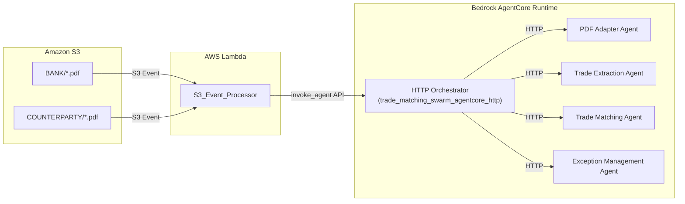

# Design Document: S3 Event-Driven Automation

## Overview

This feature adds automated triggering of the trade processing pipeline when PDF files are uploaded to S3. A Lambda function (S3_Event_Processor) will receive S3 event notifications and transform them into standardized SQS messages that trigger the existing PDF Adapter Agent. This design maintains backward compatibility with the existing agent architecture while adding event-driven automation.

### Key Design Decisions

1. **Lambda-based event processing**: Using AWS Lambda for S3 event handling provides serverless scalability and native S3 integration
2. **FIFO queue compatibility**: Messages are formatted for the existing document-upload-events FIFO queue with proper message group IDs
3. **StandardEventMessage format**: Event payloads follow the existing schema used by other agents in the system
4. **No agent modifications**: Existing production agents remain unchanged; only infrastructure additions

## Architecture



### Event Flow

1. User uploads PDF to `s3://bucket/BANK/` or `s3://bucket/COUNTERPARTY/`
2. S3 sends event notification to Lambda function
3. Lambda extracts metadata, generates correlation_id, creates StandardEventMessage
4. Lambda invokes the HTTP Orchestrator AgentCore Runtime directly via Bedrock AgentCore API
5. HTTP Orchestrator (`trade_matching_swarm_agentcore_http.py`) coordinates the full pipeline:
   - Invokes PDF Adapter Agent via HTTP
   - Invokes Trade Extraction Agent via HTTP
   - Invokes Trade Matching Agent via HTTP
   - Invokes Exception Management Agent via HTTP (if needed)

**Production Architecture**: The HTTP Orchestrator runs as a Bedrock AgentCore Runtime:
- **Runtime ARN**: `arn:aws:bedrock-agentcore:us-east-1:401552979575:runtime/trade_matching_swarm_agentcore_http-PJeubFHvY3`
- The Lambda function invokes this runtime directly using the Bedrock AgentCore API
- The HTTP Orchestrator then coordinates all downstream agents via HTTP calls

## Components and Interfaces

### S3_Event_Processor Lambda Function

**Location**: `deployment/s3_event_processor/s3_event_processor.py`

**Runtime**: Python 3.11

**Handler**: `s3_event_processor.lambda_handler`

**Environment Variables**:
- `AGENTCORE_RUNTIME_ARN`: ARN of the HTTP Orchestrator runtime (`arn:aws:bedrock-agentcore:us-east-1:401552979575:runtime/trade_matching_swarm_agentcore_http-PJeubFHvY3`)
- `S3_BUCKET_NAME`: Name of the trade documents S3 bucket
- `AWS_REGION`: AWS region (default: us-east-1)

**Input**: S3 Event Notification
```json
{
  "Records": [
    {
      "eventSource": "aws:s3",
      "eventTime": "2024-01-15T10:30:00.000Z",
      "eventName": "ObjectCreated:Put",
      "s3": {
        "bucket": {"name": "trade-matching-system-agentcore-production"},
        "object": {
          "key": "BANK/trade_confirmation_123.pdf",
          "size": 245678
        }
      }
    }
  ]
}
```

**Output**: Invokes AgentCore Runtime with payload:
```json
{
  "document_path": "s3://trade-matching-system-agentcore-production/BANK/trade_confirmation_123.pdf",
  "source_type": "BANK",
  "document_id": "trade_confirmation_123",
  "correlation_id": "corr_abc123def456"
}
```

### AgentCore Runtime Invocation

The Lambda function invokes the HTTP Orchestrator using the Bedrock AgentCore API with SigV4 authentication:

**Endpoint**: `https://bedrock-agentcore.us-east-1.amazonaws.com/runtimes/{encoded_arn}/invocations`

**Method**: POST

**Headers**:
- `Content-Type: application/json`
- `Accept: application/json`
- SigV4 signature headers (Authorization, X-Amz-Date, etc.)

**Request Body**:
```json
{
  "document_path": "s3://trade-matching-system-agentcore-production/BANK/trade.pdf",
  "source_type": "BANK",
  "document_id": "trade_confirmation_123",
  "correlation_id": "corr_abc123def456"
}
```

**Python Implementation**:
```python
import boto3
from botocore.auth import SigV4Auth
from botocore.awsrequest import AWSRequest
from urllib.parse import quote
import httpx

def invoke_agentcore_runtime(runtime_arn: str, payload: dict) -> dict:
    """Invoke AgentCore Runtime with SigV4 signing."""
    session = boto3.Session()
    credentials = session.get_credentials()
    
    # Build URL with encoded ARN
    encoded_arn = quote(runtime_arn, safe="")
    url = f"https://bedrock-agentcore.us-east-1.amazonaws.com/runtimes/{encoded_arn}/invocations"
    
    # Prepare request
    body = json.dumps(payload).encode("utf-8")
    headers = {"Content-Type": "application/json", "Accept": "application/json"}
    
    # Sign with SigV4
    request = AWSRequest(method="POST", url=url, headers=headers, data=body)
    SigV4Auth(credentials.get_frozen_credentials(), "bedrock-agentcore", "us-east-1").add_auth(request)
    
    # Make request
    response = httpx.post(url, headers=dict(request.headers), content=body, timeout=300)
    return response.json()
```

### CloudFormation Resources

**Location**: `deployment/s3_event_processor/template.yaml`

Resources to be created:
- `AWS::Lambda::Function` - The S3 event processor Lambda function
- `AWS::IAM::Role` - Lambda execution role
- `AWS::IAM::Policy` - IAM policy for S3 read and Bedrock AgentCore invoke
- `AWS::Lambda::Permission` - Permission for S3 to invoke Lambda
- S3 bucket notification configuration (via Custom Resource or AWS CLI)

### CloudFormation Template Structure

```yaml
AWSTemplateFormatVersion: '2010-09-09'
Description: S3 Event Processor for Trade Matching System

Parameters:
  AgentCoreRuntimeArn:
    Type: String
    Default: arn:aws:bedrock-agentcore:us-east-1:401552979575:runtime/trade_matching_swarm_agentcore_http-PJeubFHvY3
  S3BucketName:
    Type: String
    Default: trade-matching-system-agentcore-production

Resources:
  S3EventProcessorFunction:
    Type: AWS::Lambda::Function
    Properties:
      FunctionName: s3-event-processor
      Runtime: python3.11
      Handler: s3_event_processor.lambda_handler
      Timeout: 60
      MemorySize: 256
      Role: !GetAtt S3EventProcessorRole.Arn
      Environment:
        Variables:
          AGENTCORE_RUNTIME_ARN: !Ref AgentCoreRuntimeArn
          S3_BUCKET_NAME: !Ref S3BucketName
          AWS_REGION: !Ref AWS::Region

  S3EventProcessorRole:
    Type: AWS::IAM::Role
    Properties:
      AssumeRolePolicyDocument:
        Version: '2012-10-17'
        Statement:
          - Effect: Allow
            Principal:
              Service: lambda.amazonaws.com
            Action: sts:AssumeRole

  S3EventProcessorPolicy:
    Type: AWS::IAM::Policy
    Properties:
      PolicyName: S3EventProcessorPolicy
      Roles:
        - !Ref S3EventProcessorRole
      PolicyDocument:
        Version: '2012-10-17'
        Statement:
          - Effect: Allow
            Action:
              - bedrock-agentcore:InvokeAgent
            Resource: !Sub ${AgentCoreRuntimeArn}
          - Effect: Allow
            Action:
              - s3:GetObject
            Resource: !Sub arn:aws:s3:::${S3BucketName}/*
          - Effect: Allow
            Action:
              - logs:CreateLogGroup
              - logs:CreateLogStream
              - logs:PutLogEvents
            Resource: arn:aws:logs:*:*:*
          - Effect: Allow
            Action:
              - cloudwatch:PutMetricData
            Resource: '*'

  S3InvokeLambdaPermissionBank:
    Type: AWS::Lambda::Permission
    Properties:
      FunctionName: !Ref S3EventProcessorFunction
      Action: lambda:InvokeFunction
      Principal: s3.amazonaws.com
      SourceArn: !Sub arn:aws:s3:::${S3BucketName}
      SourceAccount: !Ref AWS::AccountId

  S3InvokeLambdaPermissionCounterparty:
    Type: AWS::Lambda::Permission
    Properties:
      FunctionName: !Ref S3EventProcessorFunction
      Action: lambda:InvokeFunction
      Principal: s3.amazonaws.com
      SourceArn: !Sub arn:aws:s3:::${S3BucketName}
      SourceAccount: !Ref AWS::AccountId
```

### IAM Policy for AgentCore Invocation

```json
{
  "Version": "2012-10-17",
  "Statement": [
    {
      "Effect": "Allow",
      "Action": [
        "bedrock-agentcore:InvokeAgent"
      ],
      "Resource": "arn:aws:bedrock-agentcore:us-east-1:401552979575:runtime/trade_matching_swarm_agentcore_http-*"
    },
    {
      "Effect": "Allow",
      "Action": [
        "s3:GetObject"
      ],
      "Resource": "arn:aws:s3:::trade-matching-system-agentcore-production/*"
    },
    {
      "Effect": "Allow",
      "Action": [
        "logs:CreateLogGroup",
        "logs:CreateLogStream",
        "logs:PutLogEvents"
      ],
      "Resource": "arn:aws:logs:*:*:*"
    },
    {
      "Effect": "Allow",
      "Action": [
        "cloudwatch:PutMetricData"
      ],
      "Resource": "*"
    }
  ]
}
```

### S3 Bucket Configuration

**Bucket Name**: `trade-matching-system-agentcore-production`

**Monitored Folders**:
- `BANK/` - Bank trade confirmation PDFs
- `COUNTERPARTY/` - Counterparty trade confirmation PDFs

### S3 Bucket Notification Configuration

The S3 bucket notification is configured via AWS CLI after CloudFormation deployment (since the bucket already exists):

```bash
# Configure S3 bucket notifications
aws s3api put-bucket-notification-configuration \
  --bucket trade-matching-system-agentcore-production \
  --notification-configuration '{
    "LambdaFunctionConfigurations": [
      {
        "LambdaFunctionArn": "arn:aws:lambda:us-east-1:401552979575:function:s3-event-processor",
        "Events": ["s3:ObjectCreated:*"],
        "Filter": {
          "Key": {
            "FilterRules": [
              {"Name": "prefix", "Value": "BANK/"},
              {"Name": "suffix", "Value": ".pdf"}
            ]
          }
        }
      },
      {
        "LambdaFunctionArn": "arn:aws:lambda:us-east-1:401552979575:function:s3-event-processor",
        "Events": ["s3:ObjectCreated:*"],
        "Filter": {
          "Key": {
            "FilterRules": [
              {"Name": "prefix", "Value": "COUNTERPARTY/"},
              {"Name": "suffix", "Value": ".pdf"}
            ]
          }
        }
      }
    ]
  }'
```

## Data Models

### Event Payload (for HTTP Orchestrator)

The payload sent to the HTTP Orchestrator matches its expected input format:

```python
@dataclass
class EventPayload:
    document_path: str      # Full S3 URI (e.g., "s3://trade-matching-system-agentcore-production/BANK/trade.pdf")
    source_type: str        # "BANK" or "COUNTERPARTY"
    document_id: str        # Unique document ID derived from S3 key (e.g., "trade_confirmation_123")
    correlation_id: str     # Tracing ID (corr_{12-char-hex})
```

**Note**: The HTTP Orchestrator expects exactly these 4 fields. The `file_size_bytes` and `upload_timestamp` are logged by the Lambda but not passed to the orchestrator.

### Source Type Inference

The source_type is inferred from the S3 key path:
- Keys starting with `BANK/` → source_type = "BANK"
- Keys starting with `COUNTERPARTY/` → source_type = "COUNTERPARTY"

### Document ID Extraction

The document_id is extracted from the S3 key by:
1. Removing the folder prefix (`BANK/` or `COUNTERPARTY/`)
2. Removing the `.pdf` extension
3. Example: `BANK/trade_confirmation_123.pdf` → `trade_confirmation_123`


## Correctness Properties

*A property is a characteristic or behavior that should hold true across all valid executions of a system-essentially, a formal statement about what the system should do. Properties serve as the bridge between human-readable specifications and machine-verifiable correctness guarantees.*

Based on the acceptance criteria analysis, the following correctness properties must be verified through property-based testing:

### Property 1: Source Type Inference Correctness

*For any* S3 event with a key path, if the path starts with `BANK/` then the resulting message source_type SHALL be "BANK", and if the path starts with `COUNTERPARTY/` then the resulting message source_type SHALL be "COUNTERPARTY".

**Validates: Requirements 1.1, 1.2**

### Property 2: Message Completeness

*For any* valid S3 event for a PDF file in a monitored folder, the resulting StandardEventMessage SHALL contain all required fields: event_id, event_type, source_agent, correlation_id, and the payload SHALL contain document_id, document_path, source_type, bucket_name, file_size_bytes, and the metadata SHALL contain upload_timestamp, s3_event_time, and lambda_request_id.

**Validates: Requirements 1.3, 5.1, 5.4, 5.5**

### Property 3: Non-PDF Filtering

*For any* S3 event where the object key does not end with `.pdf` (case-insensitive), the S3_Event_Processor SHALL return None (no message produced).

**Validates: Requirements 1.4**

### Property 4: Invalid Event Robustness

*For any* malformed S3 event (missing Records, missing s3 object, missing key fields), the S3_Event_Processor SHALL not raise an exception and SHALL return an appropriate error response or None.

**Validates: Requirements 2.2**

### Property 5: Correlation ID Format

*For any* processed S3 event, the generated correlation_id SHALL match the regex pattern `^corr_[a-f0-9]{12}$`.

**Validates: Requirements 4.1**

### Property 6: Constant Fields Invariant

*For any* valid S3 event that produces a message, the event_type field SHALL always be "DOCUMENT_UPLOADED" and the source_agent field SHALL always be "s3-event-processor".

**Validates: Requirements 5.2, 5.3**

### Property 7: Event Payload Round-Trip Serialization

*For any* valid StandardEventMessage object, serializing to JSON and then deserializing SHALL produce an equivalent object.

**Validates: Requirements 6.1**

### Property 8: Validation Rejects Incomplete Payloads

*For any* EventPayload with one or more required fields missing or None, validation SHALL fail before serialization.

**Validates: Requirements 6.2**

## Error Handling

### S3 Event Processing Errors

| Error Type | Handling Strategy | Recovery |
|------------|-------------------|----------|
| Missing S3 key | Log warning, skip record | Continue processing other records |
| Invalid event format | Log warning, return None | Lambda completes successfully |
| Non-PDF file | Silent skip (expected behavior) | Continue processing |
| SQS send failure | Retry with exponential backoff (3 attempts) | Raise exception after retries |
| Unknown source_type | Log error, skip record | Continue processing other records |

### Retry Configuration

```python
RETRY_CONFIG = {
    "max_attempts": 3,
    "base_delay_seconds": 1,
    "max_delay_seconds": 10,
    "exponential_base": 2
}
```

### CloudWatch Metrics

| Metric Name | Unit | Description |
|-------------|------|-------------|
| `S3EventsProcessed` | Count | Total S3 events received |
| `MessagesPublished` | Count | Successful SQS messages sent |
| `ProcessingErrors` | Count | Failed event processing attempts |
| `NonPdfEventsSkipped` | Count | Events skipped due to non-PDF extension |

## Testing Strategy

### Property-Based Testing

**Framework**: Hypothesis (Python)

Property-based tests will be implemented in `tests/property_based/test_s3_event_processor.py` using the Hypothesis library. Each test will run a minimum of 100 iterations with randomly generated inputs.

**Test Structure**:
```python
from hypothesis import given, strategies as st, settings

@settings(max_examples=100)
@given(s3_key=st.text())
def test_property_source_type_inference(s3_key):
    """
    **Feature: s3-event-automation, Property 1: Source Type Inference Correctness**
    """
    # Test implementation
```

### Unit Tests

Unit tests will cover:
- Individual helper functions (extract_document_id, infer_source_type)
- Edge cases for S3 key parsing
- Error handling paths
- CloudWatch metric emission

### Integration Tests

Integration tests (optional) will verify:
- End-to-end Lambda invocation with mock S3 events
- SQS message delivery verification
- Retry behavior with simulated failures

### Test File Locations

| Test Type | Location |
|-----------|----------|
| Property-based tests | `tests/property_based/test_s3_event_processor.py` |
| Unit tests | `tests/unit/test_s3_event_processor.py` |
| Integration tests | `tests/integration/test_s3_event_automation.py` |

