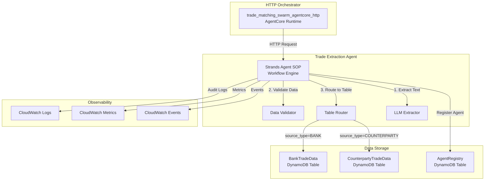

# Design Document: Trade Extraction Agent Fix and SOP Implementation

## Overview

This design addresses critical issues with the Trade Extraction Agent and implements Strands Agent SOPs for reliable workflow execution. The primary bug involves incorrect table routing where the agent updates the wrong DynamoDB table based on source_type. The solution implements a comprehensive fix with proper data routing, Strands Agent SOP integration, agent registration, and enhanced observability.

### Key Design Decisions

1. **Table routing fix**: Implement explicit source_type validation and routing logic to ensure bank data goes to BankTradeData table and counterparty data goes to CounterpartyTradeData table
2. **Strands Agent SOP integration**: Replace ad-hoc workflow logic with structured SOP-based execution for deterministic, reliable processing
3. **Enhanced validation**: Add comprehensive data validation against canonical schemas before database operations
4. **Improved observability**: Implement detailed logging, metrics, and audit trails for compliance and debugging
5. **Agent registry integration**: Proper registration in DynamoDB Model Registry for orchestration and monitoring

## Architecture



### Workflow Changes

**Before (Buggy)**:
1. Receive request → Extract data → Store in wrong table based on hardcoded logic

**After (Fixed with SOP)**:
1. Receive HTTP request from trade_matching_swarm_agentcore_http → Validate request format
2. Execute Strands Agent SOP workflow:
   - MUST validate source_type parameter
   - MUST extract trade data using LLM
   - MUST validate extracted data against schema
   - MUST route to correct table based on source_type
   - MUST log all operations with correlation_id
   - MUST emit metrics and audit events

## Components and Interfaces

### Strands Agent SOP Definition

**Location**: `deployment/trade_extraction/trade_extraction_sop.md`

The SOP defines the complete workflow using RFC 2119 keywords:

```markdown
# Trade Extraction Agent SOP

## Parameters
- document_path: S3 URI of the PDF document
- source_type: "BANK" or "COUNTERPARTY" 
- correlation_id: Unique tracing identifier

## Workflow Steps

### Step 1: Request Validation
The agent MUST validate that all required parameters are present and valid:
- document_path MUST be a valid S3 URI
- source_type MUST be either "BANK" or "COUNTERPARTY"
- correlation_id MUST follow the format "corr_[a-f0-9]{12}"

### Step 2: PDF Text Extraction
The agent MUST extract text content from the PDF document:
- MUST download the document from S3
- MUST extract text using OCR/text extraction
- SHOULD log the extraction method used

### Step 3: LLM-Based Data Extraction
The agent MUST use LLM to extract structured trade data:
- MUST use Claude Sonnet 4 with temperature 0.1
- MUST extract all required fields: trade_id, counterparty, notional_amount, trade_date
- SHOULD extract optional fields when available

### Step 4: Data Validation
The agent MUST validate extracted data against canonical schema:
- MUST validate all required fields are present
- MUST normalize currency codes to ISO 4217
- MUST convert dates to ISO 8601 format
- MUST reject incomplete records

### Step 5: Table Routing and Storage
The agent MUST route data to the correct DynamoDB table:
- IF source_type is "BANK" THEN store in BankTradeData table
- IF source_type is "COUNTERPARTY" THEN store in CounterpartyTradeData table
- MUST log the database operation with correlation_id

### Step 6: Audit and Observability
The agent MUST create audit records and emit observability data:
- MUST log processing completion with correlation_id
- MUST emit CloudWatch metrics for success/failure
- MUST create audit record linking source document to extracted data
```

### Updated Trade Extraction Agent

**Location**: `deployment/trade_extraction/trade_extraction_agent_strands.py`

**Key Changes**:
- Integration with Strands Agent SOP execution engine
- Explicit table routing logic based on source_type
- Enhanced data validation against canonical schemas
- Comprehensive logging and metrics emission
- Proper error handling and structured responses

**Input Format** (receives from trade_matching_swarm_agentcore_http):
```python
@dataclass
class TradeExtractionRequest:
    document_path: str      # S3 URI of PDF document
    source_type: str        # "BANK" or "COUNTERPARTY"
    correlation_id: str     # Tracing identifier
    
    def validate(self) -> bool:
        """Validate request parameters before processing."""
        return (
            self.document_path.startswith('s3://') and
            self.source_type in ['BANK', 'COUNTERPARTY'] and
            re.match(r'^corr_[a-f0-9]{12}$', self.correlation_id)
        )
```

**Output Format** (returns to trade_matching_swarm_agentcore_http):
```python
@dataclass
class TradeExtractionResponse:
    success: bool
    correlation_id: str
    extracted_data: Optional[Dict[str, Any]]
    table_name: Optional[str]
    error_message: Optional[str]
    processing_time_ms: int
```

### Table Router Component

**Location**: `deployment/trade_extraction/table_router.py`

```python
class TableRouter:
    def __init__(self):
        self.bank_table = "BankTradeData"
        self.counterparty_table = "CounterpartyTradeData"
    
    def get_target_table(self, source_type: str) -> str:
        """Determine target table based on source_type."""
        if source_type == "BANK":
            return self.bank_table
        elif source_type == "COUNTERPARTY":
            return self.counterparty_table
        else:
            raise ValueError(f"Invalid source_type: {source_type}")
    
    def store_trade_data(self, data: Dict, source_type: str, correlation_id: str) -> bool:
        """Store trade data in the correct table."""
        table_name = self.get_target_table(source_type)
        # DynamoDB storage logic with proper error handling
        return self._write_to_dynamodb(table_name, data, correlation_id)
```

### Data Validator Component

**Location**: `deployment/trade_extraction/data_validator.py`

```python
class TradeDataValidator:
    def __init__(self):
        self.required_fields = ['trade_id', 'counterparty', 'notional_amount', 'trade_date']
        self.currency_normalizer = CurrencyNormalizer()
        self.date_normalizer = DateNormalizer()
    
    def validate_and_normalize(self, data: Dict) -> Tuple[bool, Dict, List[str]]:
        """Validate and normalize trade data."""
        errors = []
        normalized_data = data.copy()
        
        # Check required fields
        for field in self.required_fields:
            if field not in data or data[field] is None:
                errors.append(f"Missing required field: {field}")
        
        # Normalize currency codes
        if 'currency' in data:
            normalized_data['currency'] = self.currency_normalizer.to_iso4217(data['currency'])
        
        # Normalize dates
        if 'trade_date' in data:
            normalized_data['trade_date'] = self.date_normalizer.to_iso8601(data['trade_date'])
        
        return len(errors) == 0, normalized_data, errors
```

### Agent Registry Integration

**Location**: `deployment/trade_extraction/register_agent.py`

```python
def register_trade_extraction_agent():
    """Register the Trade Extraction Agent in DynamoDB Model Registry."""
    registry_item = {
        'agent_id': 'trade-extraction-agent',
        'agent_name': 'Trade Extraction Agent',
        'agent_type': 'trade-extraction',
        'runtime_arn': 'arn:aws:bedrock-agentcore:us-east-1:401552979575:runtime/trade-extraction-agent',
        'status': 'active',
        'version': '2.0.0',
        'capabilities': ['pdf-processing', 'llm-extraction', 'data-validation', 'database-storage'],
        'created_at': datetime.utcnow().isoformat(),
        'updated_at': datetime.utcnow().isoformat(),
        'sop_enabled': True,
        'sop_version': '1.0.0'
    }
    
    dynamodb = boto3.resource('dynamodb')
    table = dynamodb.Table('AgentRegistry')
    table.put_item(Item=registry_item)
```

## Data Models

### Canonical Trade Data Schema

```python
@dataclass
class CanonicalTradeData:
    trade_id: str                    # Unique trade identifier
    counterparty: str               # Counterparty name
    notional_amount: Decimal        # Trade notional amount
    currency: str                   # ISO 4217 currency code
    trade_date: str                 # ISO 8601 date format
    maturity_date: Optional[str]    # ISO 8601 date format
    product_type: str               # Derivative product type
    correlation_id: str             # Tracing identifier
    source_document: str            # S3 URI of source PDF
    extracted_at: str               # ISO 8601 timestamp
    
    def validate(self) -> Tuple[bool, List[str]]:
        """Validate the canonical trade data."""
        errors = []
        
        if not self.trade_id:
            errors.append("trade_id is required")
        if not self.counterparty:
            errors.append("counterparty is required")
        if self.notional_amount <= 0:
            errors.append("notional_amount must be positive")
        if not re.match(r'^[A-Z]{3}$', self.currency):
            errors.append("currency must be valid ISO 4217 code")
        
        return len(errors) == 0, errors
```

### Agent Registry Schema

```python
@dataclass
class AgentRegistryEntry:
    agent_id: str                   # Unique agent identifier
    agent_name: str                 # Human-readable agent name
    agent_type: str                 # Agent classification
    runtime_arn: str                # AgentCore runtime ARN
    status: str                     # "active", "inactive", "maintenance"
    version: str                    # Semantic version
    capabilities: List[str]         # List of agent capabilities
    created_at: str                 # ISO 8601 timestamp
    updated_at: str                 # ISO 8601 timestamp
    sop_enabled: bool               # Whether SOP is enabled
    sop_version: Optional[str]      # SOP version if enabled
```

## Correctness Properties

*A property is a characteristic or behavior that should hold true across all valid executions of a system-essentially, a formal statement about what the system should do. Properties serve as the bridge between human-readable specifications and machine-verifiable correctness guarantees.*

Based on the acceptance criteria analysis, the following correctness properties must be verified through property-based testing:

### Property 1: Table Routing Correctness

*For any* trade extraction request with source_type "BANK", the extracted data SHALL be stored in the BankTradeData table, and for any request with source_type "COUNTERPARTY", the data SHALL be stored in the CounterpartyTradeData table.

**Validates: Requirements 1.1, 1.2**

### Property 2: Source Type Validation

*For any* trade extraction request, the agent SHALL validate the source_type parameter before performing any database operations, and SHALL reject requests with invalid source_type values.

**Validates: Requirements 1.3, 1.4**

### Property 3: Workflow Step Logging

*For any* SOP execution, the agent SHALL log progress at each workflow step completion with the correlation_id included in each log entry.

**Validates: Requirements 2.4, 2.6**

### Property 4: Agent Registration Completeness

*For any* agent registration record, the record SHALL contain all required fields: agent_id, agent_name, agent_type, runtime_arn, status, version, created_at, updated_at, and capabilities.

**Validates: Requirements 3.2**

### Property 5: HTTP Request Processing

*For any* valid HTTP request from trade_matching_swarm_agentcore_http, the agent SHALL accept the request and return a standardized response that can be parsed by the orchestrator.

**Validates: Requirements 4.1, 4.2**

### Property 6: Metrics Emission

*For any* trade extraction operation (successful or failed), the agent SHALL emit CloudWatch metrics including processing time and operation outcome.

**Validates: Requirements 4.3**

### Property 7: Correlation ID Propagation

*For any* trade extraction request with a correlation_id, the agent SHALL include that correlation_id in all logs, metrics, and audit records created during processing.

**Validates: Requirements 4.4**

### Property 8: Data Schema Validation

*For any* extracted trade data, the agent SHALL validate the data against the Canonical_Trade_Data schema before attempting database storage.

**Validates: Requirements 5.1**

### Property 9: Required Field Validation

*For any* trade record missing required fields (trade_id, counterparty, notional_amount, trade_date), the agent SHALL reject the record and return a structured error response.

**Validates: Requirements 5.2**

### Property 10: Currency Code Normalization

*For any* trade data containing currency information, the agent SHALL normalize currency codes to ISO 4217 standard format.

**Validates: Requirements 5.3**

### Property 11: Date Format Normalization

*For any* trade data containing date fields, the agent SHALL validate and convert dates to ISO 8601 standard format.

**Validates: Requirements 5.4**

### Property 12: Validation Error Handling

*For any* validation failure, the agent SHALL log the validation errors and return a structured error response without modifying database tables.

**Validates: Requirements 5.5**

### Property 13: Database Operation Logging

*For any* database operation, the agent SHALL log the operation with correlation_id, table_name, operation_type, and timestamp.

**Validates: Requirements 6.1**

### Property 14: Audit Trail Creation

*For any* successful trade extraction, the agent SHALL create audit records that link the source document to the extracted data.

**Validates: Requirements 6.2, 6.5**

### Property 15: CloudWatch Event Emission

*For any* successful extraction, the agent SHALL emit CloudWatch events containing document metadata and processing metrics.

**Validates: Requirements 6.3**

### Property 16: Processing History Storage

*For any* trade extraction operation, the agent SHALL maintain processing history that can be queried by correlation_id.

**Validates: Requirements 6.4**

### Property 17: Request Serialization Round-Trip

*For any* valid trade extraction request object, serializing to JSON and then deserializing SHALL produce an equivalent request object.

**Validates: Requirements 8.1**

### Property 18: Response Serialization Round-Trip

*For any* valid trade extraction response object, serializing to JSON and then deserializing SHALL produce an equivalent response object.

**Validates: Requirements 8.2**

### Property 19: Request Field Validation

*For any* incoming request, the agent SHALL validate that all required fields are present before beginning processing.

**Validates: Requirements 8.3**

### Property 20: Structured Error Response Format

*For any* error condition, the agent SHALL return structured error responses that follow a consistent schema parseable by trade_matching_swarm_agentcore_http.

**Validates: Requirements 8.4**

## Error Handling

### Error Classification and Handling

| Error Type | Handling Strategy | Recovery Action |
|------------|-------------------|-----------------|
| Invalid source_type | Log error, return structured error response | No database modification |
| Missing required fields | Log validation errors, return error response | No database modification |
| PDF extraction failure | Log error with correlation_id, retry once | Return error after retry |
| LLM extraction timeout | Log timeout, return partial results if available | Mark as partial extraction |
| Database connection failure | Log error, retry with exponential backoff | Return error after retries |
| Schema validation failure | Log validation details, return structured error | No database modification |
| Table routing failure | Log routing error with source_type | Return error response |

### SOP Error Handling

The Strands Agent SOP includes error handling procedures for each workflow step:

```markdown
### Error Handling Procedures

#### Step Failure Protocol
- MUST log the failed step with correlation_id and error details
- MUST determine if the error is recoverable or terminal
- MAY retry recoverable errors up to 3 times with exponential backoff
- MUST return structured error response for terminal errors

#### Rollback Procedures
- IF database write fails THEN no rollback needed (atomic operations)
- IF partial processing occurs THEN log partial state for debugging
- MUST NOT leave system in inconsistent state
```

### Retry Configuration

```python
RETRY_CONFIG = {
    "pdf_extraction": {"max_attempts": 2, "base_delay": 1},
    "llm_extraction": {"max_attempts": 3, "base_delay": 2},
    "database_write": {"max_attempts": 3, "base_delay": 1},
    "exponential_base": 2,
    "max_delay_seconds": 30
}
```

## Testing Strategy

### Property-Based Testing

**Framework**: Hypothesis (Python)

Property-based tests will be implemented using the Hypothesis library with a minimum of 100 iterations per test. Each property test will be tagged with a comment referencing the design document property.

**Test Structure**:
```python
from hypothesis import given, strategies as st, settings

@settings(max_examples=100)
@given(source_type=st.sampled_from(['BANK', 'COUNTERPARTY']), 
       trade_data=st.dictionaries(st.text(), st.text()))
def test_property_1_table_routing_correctness(source_type, trade_data):
    """
    **Feature: trade-extraction-agent-fix, Property 1: Table Routing Correctness**
    """
    # Test implementation
```

### Unit Testing

Unit tests will cover:
- Table routing logic with various source_type values
- Data validation functions with edge cases
- SOP workflow step execution
- Error handling paths
- Serialization/deserialization functions

### Integration Testing

Integration tests will verify:
- End-to-end SOP workflow execution
- HTTP request/response handling with trade_matching_swarm_agentcore_http
- Database connectivity and table access
- CloudWatch metrics and logging integration

### Test File Locations

| Test Type | Location |
|-----------|----------|
| Property-based tests | `tests/property_based/test_trade_extraction_agent_properties.py` |
| Unit tests | `tests/unit/test_trade_extraction_agent.py` |
| Integration tests | `tests/integration/test_trade_extraction_integration.py` |
| SOP workflow tests | `tests/sop/test_trade_extraction_sop.py` |

### Testing Configuration

- **Property tests**: Minimum 100 iterations per property
- **Unit tests**: Focus on specific functions and edge cases
- **Integration tests**: End-to-end workflow validation
- **SOP tests**: Workflow step execution and error handling

Each test will include proper tagging to reference the corresponding design property and requirements validation.