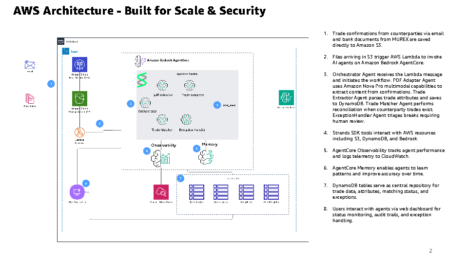
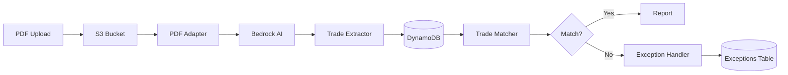

<div align="center">

# AI Trade Matching System

### Enterprise-Grade Trade Confirmation Matching Powered by AWS Bedrock

[](https://www.python.org)
[](https://aws.amazon.com/bedrock/)
[](https://strandsagents.com)
[](https://aws.amazon.com/bedrock/agentcore/)
[](LICENSE)

<br/>

**Automate trade confirmation matching with AI agents that understand financial documents**

[Getting Started](#-quick-start) | [Architecture](#-architecture) | [Documentation](#-documentation) | [Contributing](#-contributing)

<br/>



</div>

---

## Overview

The **AI Trade Matching System** is an intelligent, cloud-native solution that automates the processing and matching of derivative trade confirmations using advanced AI capabilities. Built on AWS native services with a **multi-agent swarm architecture** powered by Strands SDK, the system leverages **Amazon Nova Pro** for document analysis and implements sophisticated trade matching algorithms for financial operations teams.

### The Problem

Manual trade confirmation matching is:
- **Time-consuming**: Hours spent comparing PDF confirmations
- **Error-prone**: Human mistakes lead to settlement failures
- **Doesn't scale**: Growing trade volumes overwhelm operations teams

### The Solution

An AI-powered system that:
- **Extracts** trade data from PDF confirmations using multimodal AI
- **Matches** trades across counterparties using fuzzy matching algorithms
- **Handles exceptions** intelligently with ML-based triage
- **Scales automatically** on AWS Bedrock AgentCore Runtime

---

## Key Features

<table>
<tr>
<td width="50%">

### AI-Powered Processing
- **Amazon Nova Pro** multimodal extraction
- Intelligent document understanding
- 95%+ accuracy on trade field extraction

### Multi-Agent Architecture
- **4 specialized agents** working autonomously
- Emergent collaboration via handoffs
- Self-healing error recovery

</td>
<td width="50%">

### Enterprise Ready
- **DynamoDB** for scalable data storage
- **S3** for document management
- CloudWatch monitoring & alerts

### Production Deployment
- **AgentCore Runtime** for serverless scaling
- Terraform infrastructure as code
- React dashboard for operations

</td>
</tr>
</table>

---

## Architecture

The system uses **AgentCore Runtime** with **Agent-to-Agent (A2A) communication** for scalable, serverless processing:

```
                                    +------------------+
                                    |   AWS Bedrock    |
                                    |  Amazon Nova Pro |
                                    +--------+---------+
                                             |
    +----------------+              +--------v---------+
    |   S3 Bucket    |              | AgentCore Runtime|
    | BANK/          +------------->+   PDF Adapter    +----+
    | COUNTERPARTY/  |              |     Agent        |    |
    +----------------+              +--------+---------+    |
                                             |              |
                                    +--------v---------+    |
                                    | AgentCore Runtime|    |
                                    | Trade Extractor  |    |
                                    |     Agent        |    |
                                    +--------+---------+    |
                                             |              |
         +-------------------+      +--------v---------+    |
         |    DynamoDB       |<-----| AgentCore Runtime|    |
         | BankTradeData     |      |  Trade Matcher   |    |
         | CounterpartyData  |<-----+     Agent        |    |
         +-------------------+      +--------+---------+    |
                                             |              |
                                    +--------v---------+    |
                                    | AgentCore Runtime|<---+
                                    |Exception Handler |
                                    |     Agent        |
                                    +------------------+
                                             |
                                    +--------v---------+
                                    | AgentCore Memory |
                                    | & Observability  |
                                    +------------------+
```

### Deployment Modes

The system supports **dual deployment patterns**:

| Mode | Framework | Use Case | Communication |
|------|-----------|----------|---------------|
| **Local Development** | Strands Swarm | Testing, debugging, rapid iteration | Direct agent handoffs |
| **Production** | AgentCore Runtime | Scalable, serverless deployment | A2A communication via AgentCore |

### Agent Responsibilities

| Agent | Purpose | Key Operations | AgentCore Features |
|-------|---------|----------------|--------------------|
| **PDF Adapter** | Document ingestion | Download PDF, extract text via Bedrock multimodal, save canonical output | Memory for document patterns |
| **Trade Extractor** | Data extraction | Parse trade fields, validate data, store in DynamoDB | Memory for field mappings |
| **Trade Matcher** | Reconciliation | Match trades by attributes, calculate confidence scores, generate reports | Memory for matching patterns |
| **Exception Handler** | Issue management | Triage breaks, assign severity, track SLA deadlines | Memory for exception patterns |

### Data Flow



---

## Quick Start

### Prerequisites

- **Python 3.11+**
- **AWS Account** with Bedrock access (us-east-1)
- **AWS CLI** configured with appropriate permissions

### 1. Clone & Install

```bash
git clone git@ssh.gitlab.aws.dev:koushald/agentic-ai-reconcillation.git
cd agentic-ai-reconcillation

# Create virtual environment
python -m venv .venv
source .venv/bin/activate

# Install dependencies
pip install -r requirements.txt
```

### 2. Configure Environment

```bash
cp .env.example .env
# Edit .env with your AWS credentials
```

Required variables:
```env
AWS_ACCESS_KEY_ID=your-access-key
AWS_SECRET_ACCESS_KEY=your-secret-key
AWS_REGION=us-east-1
S3_BUCKET_NAME=your-bucket-name
```

### 3. Deploy Infrastructure

```bash
cd terraform/agentcore
terraform init
terraform apply
```

### 4. Deploy Agents to AgentCore Runtime

```bash
# Install AgentCore CLI
pip install bedrock-agentcore-starter-toolkit

# Deploy PDF Adapter Agent
cd deployment/pdf_adapter
agentcore configure --entrypoint pdf_adapter_agent_strands.py --non-interactive
agentcore launch

# Deploy Trade Extraction Agent
cd ../trade_extraction
agentcore configure --entrypoint trade_extraction_agent_strands.py --non-interactive
agentcore launch

# Deploy Trade Matching Agent
cd ../trade_matching
agentcore configure --entrypoint trade_matching_agent_strands.py --non-interactive
agentcore launch

# Deploy Exception Management Agent
cd ../exception_management
agentcore configure --entrypoint exception_management_agent_strands.py --non-interactive
agentcore launch
```

### 5. Run the System

**Local Development (Strands Swarm):**
```bash
# Process a bank trade confirmation
python deployment/swarm/trade_matching_swarm.py \
  data/BANK/FAB_26933659.pdf \
  --source-type BANK \
  --verbose

# Process a counterparty trade
python deployment/swarm/trade_matching_swarm.py \
  s3://your-bucket/COUNTERPARTY/GCS381315_V1.pdf \
  --source-type COUNTERPARTY
```

**Production (AgentCore Runtime):**
```bash
# Invoke the orchestrator agent with a trade document
agentcore invoke '{
  "document_path": "s3://your-bucket/BANK/FAB_26933659.pdf",
  "source_type": "BANK",
  "document_id": "FAB_26933659"
}' --agent orchestrator_agent

# Check agent status
agentcore status --agent pdf_adapter_agent
agentcore status --agent trade_extraction_agent
```

---

## Project Structure

```
ai-trade-matching-system/
├── deployment/                    # Agent deployment packages
│   ├── swarm/                     # Main swarm implementation
│   ├── pdf_adapter/               # PDF processing agent
│   ├── trade_extraction/          # Data extraction agent
│   ├── trade_matching/            # Matching agent
│   ├── exception_management/      # Exception handling agent
│   └── orchestrator/              # Orchestration agent

├── terraform/                     # Infrastructure as Code
│   └── agentcore/                 # AgentCore deployment
├── web-portal/                    # React dashboard
├── web-portal-api/                # FastAPI backend
├── tests/                         # Test suites
├── config/                        # Configuration files
└── data/                          # Sample trade PDFs
```

---

## Web Dashboard

The system includes a **React-based dashboard** for operations teams:

- **Real-time agent monitoring** - Track agent health and performance
- **Trade matching results** - View matched/unmatched trades
- **Exception management** - Handle breaks and discrepancies
- **Processing metrics** - Monitor throughput and latency

### Running the Dashboard

```bash
# Start the API backend
cd web-portal-api
pip install -r requirements.txt
uvicorn app.main:app --reload --port 8001

# Start the frontend (in another terminal)
cd web-portal
npm install
npm run dev
```

---

## AWS Services

| Service | Purpose | Integration |
|---------|---------|-------------|
| **Bedrock** | Amazon Nova Pro for document analysis | Direct multimodal PDF processing |
| **AgentCore Runtime** | Serverless agent deployment & scaling | Production agent hosting with A2A communication |
| **AgentCore Memory** | Persistent agent context & knowledge | Trade history and matching patterns |
| **AgentCore Observability** | Real-time monitoring & tracing | Agent performance and workflow tracking |
| **DynamoDB** | Trade data & exceptions storage | Structured data persistence |
| **S3** | Document & report storage | PDF inputs and canonical outputs |
| **CloudWatch** | System monitoring & logging | Infrastructure and application metrics |
| **IAM** | Security & access control | Fine-grained permissions for agents |

---

## Performance

| Metric | Value |
|--------|-------|
| PDF Processing | ~5 seconds |
| OCR Extraction (5 pages) | ~30-45 seconds |
| Trade Matching | ~10-20 seconds |
| **Total per Trade** | **~60-90 seconds** |

---

## Documentation

| Document | Description |
|----------|-------------|
| [ARCHITECTURE.md](ARCHITECTURE.md) | Detailed system architecture |
| [HOW_TO_RUN_TESTS.md](HOW_TO_RUN_TESTS.md) | Testing guide |
| [terraform/agentcore/README.md](terraform/agentcore/README.md) | Infrastructure deployment |
| [deployment/README.md](deployment/README.md) | Agent deployment guide |

---

## AgentCore Integration

### Agent-to-Agent Communication

The system leverages **AgentCore Runtime's native A2A capabilities** for seamless agent communication:

```python
# Agent 1 can invoke Agent 2 directly
from bedrock_agentcore import BedrockAgentCoreApp

app = BedrockAgentCoreApp()

@app.entrypoint
def invoke(payload, context):
    # Process initial request
    result = process_document(payload)
    
    # Hand off to next agent
    next_agent_response = context.invoke_agent(
        agent_arn="arn:aws:bedrock-agentcore:us-east-1:YOUR_ACCOUNT_ID:runtime/trade-extraction-agent",
        payload={"canonical_output": result}
    )
    
    return next_agent_response
```

### Memory Integration

**AgentCore Memory** provides persistent context across agent interactions:

- **Trade History**: Remember previous matching patterns
- **Counterparty Profiles**: Learn counterparty-specific document formats
- **Exception Patterns**: Improve exception classification over time
- **Performance Metrics**: Track and optimize agent performance

### Observability & Monitoring

**AgentCore Observability** provides comprehensive monitoring:

- **Real-time Tracing**: Track requests across all agents
- **Performance Metrics**: Latency, throughput, error rates
- **Token Usage**: Monitor LLM costs and optimization opportunities
- **Custom Metrics**: Trade-specific KPIs and SLA tracking

### Production Deployment Patterns

#### Multi-Agent Runtime Architecture

```yaml
# .bedrock_agentcore.yaml
agents:
  pdf_adapter:
    entrypoint: pdf_adapter_agent_strands.py
    memory_enabled: true
    vpc_enabled: true
    
  trade_extraction:
    entrypoint: trade_extraction_agent_strands.py
    memory_enabled: true
    depends_on: [pdf_adapter]
    
  trade_matching:
    entrypoint: trade_matching_agent_strands.py
    memory_enabled: true
    depends_on: [trade_extraction]
    
  exception_management:
    entrypoint: exception_management_agent_strands.py
    memory_enabled: true
    depends_on: [trade_matching]
```

#### Security & Compliance

- **VPC Isolation**: Deploy agents in private subnets
- **IAM Least Privilege**: Fine-grained permissions per agent
- **Encryption**: End-to-end encryption for sensitive trade data
- **Audit Logging**: Complete audit trail via CloudTrail and AgentCore logs

---

## Development

### Running Tests

```bash
# Run all tests
pytest tests/ -v

# Run property-based tests
pytest tests/property_based/ -v

# Run end-to-end tests
pytest tests/e2e/ -v
```

### Adding a New Agent

**For Local Development (Strands Swarm):**
1. Create agent factory function in `deployment/swarm/`
2. Define tools with `@tool` decorator
3. Update swarm configuration with handoff conditions

**For Production (AgentCore Runtime):**
1. Create agent file with `BedrockAgentCoreApp` wrapper:
   ```python
   from bedrock_agentcore import BedrockAgentCoreApp
   from strands import Agent
   
   app = BedrockAgentCoreApp()
   
   @app.entrypoint
   def invoke(payload, context):
       # Your agent logic here
       return {"result": result}
   
   if __name__ == "__main__":
       app.run()
   ```

2. Deploy to AgentCore:
   ```bash
   agentcore configure --entrypoint new_agent.py --non-interactive
   agentcore launch
   ```

### Troubleshooting

#### AgentCore Deployment Issues

**Common Issues:**

1. **Missing BedrockAgentCoreApp Import**
   ```bash
   Error: Agent must import BedrockAgentCoreApp
   ```
   **Solution:** Add `from bedrock_agentcore import BedrockAgentCoreApp`

2. **Missing @app.entrypoint Decorator**
   ```bash
   Error: No entrypoint function found
   ```
   **Solution:** Add `@app.entrypoint` decorator to your invoke function

3. **Requirements.txt Issues**
   ```bash
   Error: bedrock-agentcore not found
   ```
   **Solution:** Add `bedrock-agentcore` to requirements.txt

4. **Agent Communication Failures**
   ```bash
   Error: Unable to invoke target agent
   ```
   **Solution:** Check IAM permissions for `bedrock-agentcore:InvokeAgentRuntime`

#### Performance Optimization

- **Token Usage**: Monitor via AgentCore Observability dashboard
- **Latency**: Use AgentCore Memory for caching frequent operations
- **Throughput**: Scale agents independently based on workload
- **Cost**: Optimize model selection per agent (Nova Pro vs Claude)

---

## Contributing

Contributions are welcome! Please:

1. Fork the repository
2. Create a feature branch (`git checkout -b feature/amazing-feature`)
3. Commit your changes (`git commit -m 'Add amazing feature'`)
4. Push to the branch (`git push origin feature/amazing-feature`)
5. Open a Merge Request

---

## License

This project is licensed under the **MIT License** - see the [LICENSE](LICENSE) file for details.

---

<div align="center">

**Built for derivatives operations teams worldwide**

[Report Bug](https://ssh.gitlab.aws.dev/koushald/agentic-ai-reconcillation/-/issues) | [Request Feature](https://ssh.gitlab.aws.dev/koushald/agentic-ai-reconcillation/-/issues) | [Documentation](docs/)

</div>
