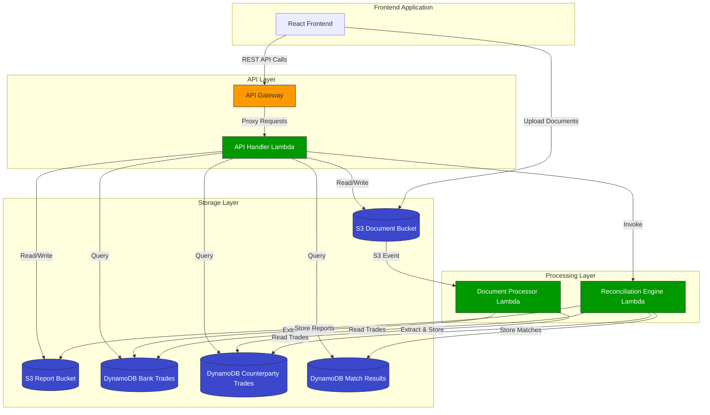

# Trade Reconciliation System Architecture

The following diagram illustrates the architecture of the Trade Reconciliation System:

## Data Flow

1. **Document Upload Flow**:
   - User uploads bank and counterparty trade documents through the frontend
   - Files are stored in the S3 Document Bucket
   - S3 triggers the Document Processor Lambda
   - Document Processor extracts trade data and stores it in DynamoDB tables

2. **Reconciliation Flow**:
   - User selects documents and initiates reconciliation through the frontend
   - API Gateway routes the request to the API Handler Lambda
   - API Handler invokes the Reconciliation Engine Lambda
   - Reconciliation Engine compares trades and identifies matches/discrepancies
   - Match results are stored in DynamoDB and a report is generated in S3

3. **Results Retrieval Flow**:
   - User requests reconciliation results through the frontend
   - API Gateway routes the request to the API Handler Lambda
   - API Handler retrieves match data from DynamoDB and reports from S3
   - Results are displayed in the frontend
