# AWS Services Architecture Diagram

## Complete AWS Infrastructure

```mermaid
graph TB
    subgraph "AWS Cloud - Region: me-central-1"
        subgraph "Storage Services"
            S3[("Amazon S3<br/>otc-menat-2025<br/>────────────<br/>Folders:<br/>• BANK/<br/>• COUNTERPARTY/<br/>• PDFIMAGES/<br/>• extracted/<br/>• reports/")]
        end

        subgraph "AI/ML Services"
            Bedrock["AWS Bedrock<br/>────────────<br/>Model: Claude Sonnet 4<br/>apac.anthropic.claude-<br/>sonnet-4-20250514-v1:0<br/>────────────<br/>Temperature: 0.7<br/>Max Tokens: 4096<br/>Rate Limit: 2 RPM"]
        end

        subgraph "Database Services"
            DDB1[("Amazon DynamoDB<br/>BankTradeData<br/>────────────<br/>PK: Trade_ID<br/>Billing: PAY_PER_REQUEST<br/>────────────<br/>Attributes:<br/>• TRADE_SOURCE: BANK<br/>• trade_date<br/>• notional<br/>• 30+ fields")]

            DDB2[("Amazon DynamoDB<br/>CounterpartyTradeData<br/>────────────<br/>PK: Trade_ID<br/>Billing: PAY_PER_REQUEST<br/>────────────<br/>Attributes:<br/>• TRADE_SOURCE: COUNTERPARTY<br/>• trade_date<br/>• notional<br/>• 30+ fields")]
        end

        subgraph "Compute & Application"
            CrewAI["CrewAI Application<br/>────────────<br/>5 Specialized Agents:<br/>1. Document Processor<br/>2. OCR Processor<br/>3. Trade Entity Extractor<br/>4. Reporting Analyst<br/>5. Matching Analyst<br/>────────────<br/>Framework: CrewAI 0.175+<br/>Runtime: Python 3.11+"]
        end

        subgraph "Integration Layer"
            MCP["Model Context Protocol<br/>────────────<br/>Server: awslabs.aws-api-<br/>mcp-server@latest<br/>────────────<br/>Provides AWS CLI<br/>commands as MCP tools"]

            Boto3["Custom boto3 Tool<br/>────────────<br/>Direct DynamoDB API<br/>• put_item()<br/>• scan()"]
        end

        subgraph "Security & IAM"
            IAM["AWS IAM<br/>────────────<br/>Credentials:<br/>• AWS_ACCESS_KEY_ID<br/>• AWS_SECRET_ACCESS_KEY<br/>────────────<br/>Permissions:<br/>• S3: Read/Write<br/>• DynamoDB: Read/Write<br/>• Bedrock: InvokeModel"]
        end
    end

    %% External Input
    User[👤 User<br/>Upload Trade PDFs]

    %% Data Flow
    User --> S3
    S3 --> CrewAI
    CrewAI --> Bedrock
    Bedrock --> CrewAI
    CrewAI --> MCP
    CrewAI --> Boto3
    MCP --> DDB1
    MCP --> DDB2
    Boto3 --> DDB1
    Boto3 --> DDB2
    CrewAI --> S3
    IAM -.->|Authenticate| CrewAI
    IAM -.->|Authorize| S3
    IAM -.->|Authorize| DDB1
    IAM -.->|Authorize| DDB2
    IAM -.->|Authorize| Bedrock

    %% Styling
    classDef storage fill:#FF9900,stroke:#232F3E,stroke-width:3px,color:#fff
    classDef compute fill:#00A4BD,stroke:#232F3E,stroke-width:3px,color:#fff
    classDef ai fill:#527FFF,stroke:#232F3E,stroke-width:3px,color:#fff
    classDef database fill:#3F8624,stroke:#232F3E,stroke-width:3px,color:#fff
    classDef integration fill:#DD344C,stroke:#232F3E,stroke-width:3px,color:#fff
    classDef security fill:#DD344C,stroke:#232F3E,stroke-width:3px,color:#fff
    classDef user fill:#666,stroke:#232F3E,stroke-width:3px,color:#fff

    class S3 storage
    class CrewAI compute
    class Bedrock ai
    class DDB1,DDB2 database
    class MCP,Boto3 integration
    class IAM security
    class User user
```

## AWS Service Details

| Service | Configuration | Purpose |
|---------|--------------|---------|
| **Amazon S3** | Bucket: `otc-menat-2025` Region: `me-central-1` Encryption: At rest | Document storage, image storage, report storage |
| **AWS Bedrock** | Model: Claude Sonnet 4 (APAC) ID: `apac.anthropic.claude-sonnet-4-20250514-v1:0` Temp: 0.7, Max Tokens: 4096 | AI-powered document processing, OCR, entity extraction |
| **Amazon DynamoDB** | Tables: 2 (BankTradeData, CounterpartyTradeData) Billing: PAY_PER_REQUEST PK: Trade_ID (String) | Trade data persistence with typed attributes |
| **AWS IAM** | Credentials: Environment variables Permissions: S3, DynamoDB, Bedrock | Authentication and authorization |
| **MCP Server** | Package: `awslabs.aws-api-mcp-server@latest` Runtime: uvx | AWS service integration via Model Context Protocol |

## Data Flow Summary

## Cost Estimation

| Service | Estimated Monthly Cost | Notes |
|---------|----------------------|-------|
| **AWS Bedrock** | $50-$100 | Based on ~120K tokens per trade, ~100-200 trades/month |
| **Amazon S3** | $5-$10 | Storage + requests for PDFs, images, reports |
| **DynamoDB** | $5-$15 | PAY_PER_REQUEST billing, ~100-200 writes/reads per trade |
| **Data Transfer** | $2-$5 | Within same region (minimal) |
| **Total** | **$62-$130/month** | For ~100-200 trade confirmations |

## Performance Metrics

| Metric | Value | Optimization |
|--------|-------|--------------|
| **Processing Time** | 60-90 seconds per trade | Sequential agent processing |
| **Token Usage** | ~120K tokens per trade | 85% reduction via scratchpad pattern |
| **S3 Operations** | ~15 operations per trade | Efficient folder structure |
| **DynamoDB Operations** | ~3-5 operations per trade | Put + Scan operations |
| **Bedrock API Calls** | ~20-25 per trade | Rate limited to 2 RPM |

## Security Best Practices

1. **IAM Least Privilege**
   - Separate roles for read/write operations
   - Service-specific permissions only
   - No wildcard permissions

2. **Data Encryption**
   - S3: Server-side encryption (SSE-S3)
   - DynamoDB: Encryption at rest enabled
   - In-transit: TLS 1.2+ for all AWS API calls

3. **Credentials Management**
   - Environment variables (not hardcoded)
   - AWS IAM roles preferred over access keys
   - Regular credential rotation

4. **Network Security**
   - VPC endpoints for private access (optional)
   - S3 bucket policies for access control
   - CloudTrail for audit logging

---

**Last Updated**: October 2025
**Region**: me-central-1 (Middle East - UAE)
**Architecture Version**: 1.0
