# AWS Services Architecture Diagram

## Complete AWS Infrastructure

```mermaid
graph TB
    subgraph "AWS Cloud - Region: us-east-1"
        subgraph "Storage Services"
            S3[("Amazon S3<br/>trade-matching-system-<br/>agentcore-production<br/>────────────<br/>Folders:<br/>• BANK/<br/>• COUNTERPARTY/<br/>• extracted/<br/>• reports/")]
        end

        subgraph "AI/ML Services"
            Bedrock["AWS Bedrock<br/>────────────<br/>Model: Amazon Nova Pro<br/>amazon.nova-pro-v1:0<br/>────────────<br/>Temperature: 0.1<br/>Max Tokens: 4096<br/>Framework: Strands SDK"]
        end

        subgraph "Database Services"
            DDB1[("Amazon DynamoDB<br/>BankTradeData<br/>────────────<br/>PK: Trade_ID<br/>Billing: PAY_PER_REQUEST<br/>────────────<br/>Attributes:<br/>• TRADE_SOURCE: BANK<br/>• trade_date<br/>• notional<br/>• 30+ fields")]

            DDB2[("Amazon DynamoDB<br/>CounterpartyTradeData<br/>────────────<br/>PK: Trade_ID<br/>Billing: PAY_PER_REQUEST<br/>────────────<br/>Attributes:<br/>• TRADE_SOURCE: COUNTERPARTY<br/>• trade_date<br/>• notional<br/>• 30+ fields")]
        end

        subgraph "Compute & Application"
            AgentCore["Amazon Bedrock<br/>AgentCore Runtime<br/>────────────<br/>5 Specialized Agents:<br/>1. PDF Adapter<br/>2. Trade Extraction<br/>3. Trade Matching<br/>4. Exception Management<br/>5. Orchestrator<br/>────────────<br/>Framework: Strands SDK<br/>Runtime: Serverless"]
        end

        subgraph "Integration Layer"
            SQS["Amazon SQS<br/>────────────<br/>Event-driven<br/>communication<br/>────────────<br/>10+ queues for<br/>agent coordination"]

            Strands["Strands SDK<br/>────────────<br/>use_aws tool<br/>────────────<br/>S3, DynamoDB,<br/>Bedrock operations"]
        end

        subgraph "Security & IAM"
            IAM["AWS IAM<br/>────────────<br/>Credentials:<br/>• AWS_ACCESS_KEY_ID<br/>• AWS_SECRET_ACCESS_KEY<br/>────────────<br/>Permissions:<br/>• S3: Read/Write<br/>• DynamoDB: Read/Write<br/>• Bedrock: InvokeModel"]
        end
    end

    %% External Input
    User[👤 User<br/>Upload Trade PDFs]

    %% Data Flow
    User --> S3
    S3 --> CrewAI
    CrewAI --> Bedrock
    Bedrock --> CrewAI
    CrewAI --> MCP
    CrewAI --> Boto3
    MCP --> DDB1
    MCP --> DDB2
    Boto3 --> DDB1
    Boto3 --> DDB2
    CrewAI --> S3
    IAM -.->|Authenticate| CrewAI
    IAM -.->|Authorize| S3
    IAM -.->|Authorize| DDB1
    IAM -.->|Authorize| DDB2
    IAM -.->|Authorize| Bedrock

    %% Styling
    classDef storage fill:#FF9900,stroke:#232F3E,stroke-width:3px,color:#fff
    classDef compute fill:#00A4BD,stroke:#232F3E,stroke-width:3px,color:#fff
    classDef ai fill:#527FFF,stroke:#232F3E,stroke-width:3px,color:#fff
    classDef database fill:#3F8624,stroke:#232F3E,stroke-width:3px,color:#fff
    classDef integration fill:#DD344C,stroke:#232F3E,stroke-width:3px,color:#fff
    classDef security fill:#DD344C,stroke:#232F3E,stroke-width:3px,color:#fff
    classDef user fill:#666,stroke:#232F3E,stroke-width:3px,color:#fff

    class S3 storage
    class AgentCore compute
    class Bedrock ai
    class DDB1,DDB2 database
    class SQS,Strands integration
    class IAM security
    class User user
```

## AWS Service Details

| Service | Configuration | Purpose |
|---------|--------------|---------|
| **Amazon S3** | Bucket: `trade-matching-system-agentcore-production` Region: `us-east-1` Encryption: At rest | Document storage, canonical outputs, report storage |
| **AWS Bedrock** | Model: Amazon Nova Pro ID: `amazon.nova-pro-v1:0` Temp: 0.1, Max Tokens: 4096 | AI-powered document processing, text extraction, entity extraction |
| **Amazon DynamoDB** | Tables: 4 (BankTradeData, CounterpartyTradeData, ExceptionsTable, AgentRegistry) Billing: PAY_PER_REQUEST PK: trade_id or agent_id | Trade data persistence, exception tracking, agent registry |
| **Amazon SQS** | 10+ queues for event-driven communication FIFO and Standard queues | Agent coordination, event routing, HITL workflows |
| **Bedrock AgentCore** | Runtime: Serverless Scaling: Auto (1-10 instances) Memory: 2-4GB per agent | Agent execution platform with managed infrastructure |
| **Strands SDK** | Tool: `use_aws` Operations: S3, DynamoDB, Bedrock | LLM-powered agents with built-in AWS operations |
| **AWS IAM** | Credentials: IAM roles (preferred) Permissions: S3, DynamoDB, Bedrock, SQS | Authentication and authorization |

## Data Flow Summary

## Cost Estimation

| Service | Estimated Monthly Cost | Notes |
|---------|----------------------|-------|
| **AWS Bedrock** | $50-$150 | Based on token usage per trade, ~100-200 trades/month |
| **Bedrock AgentCore** | $20-$50 | Serverless agent execution, pay per invocation |
| **Amazon S3** | $5-$10 | Storage + requests for PDFs, canonical outputs, reports |
| **DynamoDB** | $10-$20 | PAY_PER_REQUEST billing, 4 tables |
| **Amazon SQS** | $2-$5 | Message processing across 10+ queues |
| **Data Transfer** | $2-$5 | Within same region (minimal) |
| **Total** | **$89-$240/month** | For ~100-200 trade confirmations |

## Performance Metrics

| Metric | Value | Optimization |
|--------|-------|--------------|
| **Processing Time** | 40-70 seconds per trade | Event-driven parallel processing |
| **Token Usage** | Varies by document | LLM-driven field extraction |
| **S3 Operations** | ~10 operations per trade | Canonical output pattern |
| **DynamoDB Operations** | ~3-5 operations per trade | Strands use_aws tool |
| **SQS Messages** | ~5-10 per trade | Event-driven coordination |
| **Bedrock API Calls** | ~10-15 per trade | Direct PDF processing (no images) |

## Security Best Practices

1. **IAM Least Privilege**
   - Separate roles for read/write operations
   - Service-specific permissions only
   - No wildcard permissions

2. **Data Encryption**
   - S3: Server-side encryption (SSE-S3)
   - DynamoDB: Encryption at rest enabled
   - In-transit: TLS 1.2+ for all AWS API calls

3. **Credentials Management**
   - Environment variables (not hardcoded)
   - AWS IAM roles preferred over access keys
   - Regular credential rotation

4. **Network Security**
   - VPC endpoints for private access (optional)
   - S3 bucket policies for access control
   - CloudTrail for audit logging

---

**Last Updated**: December 2024
**Region**: us-east-1 (US East)
**Architecture Version**: 2.0 (AgentCore + Strands)
