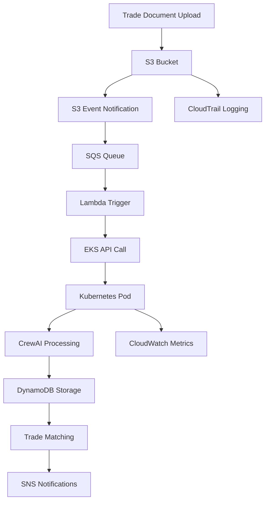
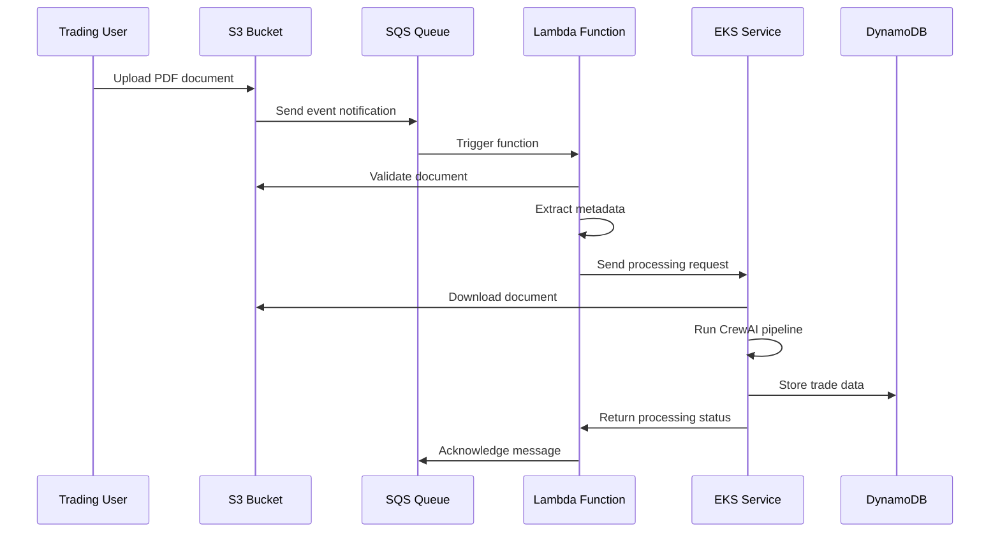

# S3 Event-Driven Architecture for Trade Matching System

## Architecture Overview

This document details the S3 event-driven architecture that triggers automated processing when trade documents (PDFs) are uploaded to designated S3 buckets, replacing the current file-based approach with a scalable, event-driven system.

## Event Flow Architecture



## S3 Bucket Structure and Event Configuration

### 1. Bucket Organization

```
trade-documents-bucket/
├── BANK/                    # Bank-originated trade confirmations
│   ├── 2024/01/01/         # Date-based partitioning
│   ├── 2024/01/02/
│   └── ...
├── COUNTERPARTY/           # Counterparty confirmations
│   ├── 2024/01/01/
│   ├── 2024/01/02/
│   └── ...
├── PROCESSED/              # Successfully processed documents
│   ├── BANK/
│   └── COUNTERPARTY/
├── FAILED/                 # Failed processing documents
│   ├── BANK/
│   └── COUNTERPARTY/
└── QUARANTINE/             # Suspicious or invalid documents
```

### 2. S3 Event Configuration (CloudFormation)

```yaml
# s3-event-configuration.yaml
AWSTemplateFormatVersion: '2010-09-09'
Description: 'S3 Event-driven architecture for trade document processing'

Parameters:
  Environment:
    Type: String
    Default: production
    AllowedValues: [development, staging, production]

  EKSClusterName:
    Type: String
    Default: trade-matching-cluster

  AlertEmail:
    Type: String
    Description: Email for alerts and notifications

Resources:
  # S3 Bucket for trade documents
  TradeDocumentsBucket:
    Type: AWS::S3::Bucket
    Properties:
      BucketName: !Sub 'trade-documents-${Environment}-${AWS::AccountId}'
      VersioningConfiguration:
        Status: Enabled

      # Lifecycle configuration
      LifecycleConfiguration:
        Rules:
          - Id: MoveToIA
            Status: Enabled
            Transitions:
              - StorageClass: STANDARD_IA
                TransitionInDays: 30
          - Id: MoveToGlacier
            Status: Enabled
            Transitions:
              - StorageClass: GLACIER
                TransitionInDays: 90
          - Id: DeleteOldVersions
            Status: Enabled
            NoncurrentVersionExpirationInDays: 365

      # Security configuration
      PublicAccessBlockConfiguration:
        BlockPublicAcls: true
        BlockPublicPolicy: true
        IgnorePublicAcls: true
        RestrictPublicBuckets: true

      # CORS configuration for potential web uploads
      CorsConfiguration:
        CorsRules:
          - AllowedHeaders: ['*']
            AllowedMethods: [PUT, POST]
            AllowedOrigins: ['https://your-trading-portal.com']
            MaxAge: 3000

      # Server-side encryption
      BucketEncryption:
        ServerSideEncryptionConfiguration:
          - ServerSideEncryptionByDefault:
              SSEAlgorithm: AES256

      # Event notifications
      NotificationConfiguration:
        QueueConfigurations:
          # Bank document events
          - Event: s3:ObjectCreated:*
            Queue: !GetAtt BankDocumentQueue.Arn
            Filter:
              S3Key:
                Rules:
                  - Name: prefix
                    Value: "BANK/"
                  - Name: suffix
                    Value: ".pdf"

          # Counterparty document events
          - Event: s3:ObjectCreated:*
            Queue: !GetAtt CounterpartyDocumentQueue.Arn
            Filter:
              S3Key:
                Rules:
                  - Name: prefix
                    Value: "COUNTERPARTY/"
                  - Name: suffix
                    Value: ".pdf"

          # Failed processing notifications
          - Event: s3:ObjectCreated:*
            Queue: !GetAtt FailedProcessingQueue.Arn
            Filter:
              S3Key:
                Rules:
                  - Name: prefix
                    Value: "FAILED/"

  # SQS Queues for different document types
  BankDocumentQueue:
    Type: AWS::SQS::Queue
    Properties:
      QueueName: !Sub 'bank-documents-${Environment}'
      VisibilityTimeoutSeconds: 900  # 15 minutes
      MessageRetentionPeriod: 1209600  # 14 days
      DelaySeconds: 0
      RedrivePolicy:
        deadLetterTargetArn: !GetAtt BankDocumentDLQ.Arn
        maxReceiveCount: 3
      Tags:
        - Key: Environment
          Value: !Ref Environment
        - Key: DocumentType
          Value: Bank

  CounterpartyDocumentQueue:
    Type: AWS::SQS::Queue
    Properties:
      QueueName: !Sub 'counterparty-documents-${Environment}'
      VisibilityTimeoutSeconds: 900
      MessageRetentionPeriod: 1209600
      DelaySeconds: 0
      RedrivePolicy:
        deadLetterTargetArn: !GetAtt CounterpartyDocumentDLQ.Arn
        maxReceiveCount: 3
      Tags:
        - Key: Environment
          Value: !Ref Environment
        - Key: DocumentType
          Value: Counterparty

  FailedProcessingQueue:
    Type: AWS::SQS::Queue
    Properties:
      QueueName: !Sub 'failed-processing-${Environment}'
      VisibilityTimeoutSeconds: 300
      MessageRetentionPeriod: 1209600
      Tags:
        - Key: Environment
          Value: !Ref Environment
        - Key: Purpose
          Value: FailedProcessing

  # Dead Letter Queues
  BankDocumentDLQ:
    Type: AWS::SQS::Queue
    Properties:
      QueueName: !Sub 'bank-documents-dlq-${Environment}'
      MessageRetentionPeriod: 1209600

  CounterpartyDocumentDLQ:
    Type: AWS::SQS::Queue
    Properties:
      QueueName: !Sub 'counterparty-documents-dlq-${Environment}'
      MessageRetentionPeriod: 1209600

  # Queue Policies
  BankQueuePolicy:
    Type: AWS::SQS::QueuePolicy
    Properties:
      Queues:
        - !Ref BankDocumentQueue
      PolicyDocument:
        Statement:
          - Effect: Allow
            Principal:
              Service: s3.amazonaws.com
            Action: sqs:SendMessage
            Resource: !GetAtt BankDocumentQueue.Arn
            Condition:
              ArnEquals:
                aws:SourceArn: !GetAtt TradeDocumentsBucket.Arn

  CounterpartyQueuePolicy:
    Type: AWS::SQS::QueuePolicy
    Properties:
      Queues:
        - !Ref CounterpartyDocumentQueue
      PolicyDocument:
        Statement:
          - Effect: Allow
            Principal:
              Service: s3.amazonaws.com
            Action: sqs:SendMessage
            Resource: !GetAtt CounterpartyDocumentQueue.Arn
            Condition:
              ArnEquals:
                aws:SourceArn: !GetAtt TradeDocumentsBucket.Arn

  # SNS Topics for notifications
  ProcessingNotificationsTopic:
    Type: AWS::SNS::Topic
    Properties:
      TopicName: !Sub 'trade-processing-notifications-${Environment}'
      DisplayName: Trade Processing Notifications

  ProcessingNotificationsSubscription:
    Type: AWS::SNS::Subscription
    Properties:
      Protocol: email
      TopicArn: !Ref ProcessingNotificationsTopic
      Endpoint: !Ref AlertEmail

Outputs:
  BucketName:
    Description: 'S3 bucket for trade documents'
    Value: !Ref TradeDocumentsBucket
    Export:
      Name: !Sub '${AWS::StackName}-bucket-name'

  BankQueueUrl:
    Description: 'SQS queue URL for bank documents'
    Value: !Ref BankDocumentQueue
    Export:
      Name: !Sub '${AWS::StackName}-bank-queue-url'

  CounterpartyQueueUrl:
    Description: 'SQS queue URL for counterparty documents'
    Value: !Ref CounterpartyDocumentQueue
    Export:
      Name: !Sub '${AWS::StackName}-counterparty-queue-url'
```

## Lambda Function for SQS Processing

### 1. Enhanced Lambda Function

```python
# lambda-function/main.py
import json
import boto3
import requests
import os
import logging
from typing import Dict, Any, List
from datetime import datetime
from botocore.exceptions import ClientError
import base64
import hashlib

# Configure logging
logging.basicConfig(level=logging.INFO)
logger = logging.getLogger(__name__)

class TradeDocumentProcessor:
    def __init__(self):
        self.s3_client = boto3.client('s3')
        self.sns_client = boto3.client('sns')
        self.cloudwatch = boto3.client('cloudwatch')

        # Configuration from environment variables
        self.eks_service_endpoint = os.environ.get(
            'EKS_SERVICE_ENDPOINT',
            'http://trade-matching-service.trading.svc.cluster.local/process'
        )
        self.sns_topic_arn = os.environ.get('SNS_TOPIC_ARN')
        self.max_retries = int(os.environ.get('MAX_RETRIES', '3'))
        self.processing_timeout = int(os.environ.get('PROCESSING_TIMEOUT', '300'))

    def validate_document(self, bucket: str, key: str) -> Dict[str, Any]:
        """Validate document before processing"""
        try:
            # Get object metadata
            response = self.s3_client.head_object(Bucket=bucket, Key=key)

            # Check file size (max 50MB)
            file_size = response['ContentLength']
            if file_size > 50 * 1024 * 1024:
                return {
                    'valid': False,
                    'reason': f'File too large: {file_size} bytes (max 50MB)'
                }

            # Check if it's a PDF
            if not key.lower().endswith('.pdf'):
                return {
                    'valid': False,
                    'reason': 'Not a PDF file'
                }

            # Check if already processed
            processed_key = f"PROCESSED/{key}"
            try:
                self.s3_client.head_object(Bucket=bucket, Key=processed_key)
                return {
                    'valid': False,
                    'reason': 'Document already processed'
                }
            except ClientError as e:
                if e.response['Error']['Code'] != '404':
                    raise

            # Generate document hash for deduplication
            obj_data = self.s3_client.get_object(Bucket=bucket, Key=key)
            content = obj_data['Body'].read()
            doc_hash = hashlib.sha256(content).hexdigest()

            return {
                'valid': True,
                'file_size': file_size,
                'doc_hash': doc_hash,
                'last_modified': response['LastModified'].isoformat()
            }

        except Exception as e:
            logger.error(f"Error validating document {key}: {str(e)}")
            return {
                'valid': False,
                'reason': f'Validation error: {str(e)}'
            }

    def determine_source_type(self, key: str) -> str:
        """Determine if document is from BANK or COUNTERPARTY"""
        if key.startswith('BANK/'):
            return 'BANK'
        elif key.startswith('COUNTERPARTY/'):
            return 'COUNTERPARTY'
        else:
            return 'UNKNOWN'

    def extract_metadata(self, key: str, s3_metadata: Dict) -> Dict[str, Any]:
        """Extract metadata from S3 object and key structure"""
        # Parse key structure: SOURCE/YYYY/MM/DD/filename.pdf
        key_parts = key.split('/')

        metadata = {
            'source_path': key,
            'filename': key_parts[-1],
            'upload_timestamp': datetime.utcnow().isoformat(),
            'unique_identifier': key_parts[-1].replace('.pdf', '').replace('.PDF', '')
        }

        # Extract date from path if available
        if len(key_parts) >= 4:
            try:
                year, month, day = key_parts[1:4]
                metadata['trade_date'] = f"{year}-{month}-{day}"
            except (ValueError, IndexError):
                logger.warning(f"Could not parse date from path: {key}")

        # Add S3 metadata
        metadata.update({
            'etag': s3_metadata.get('ETag', '').strip('"'),
            'content_type': s3_metadata.get('ContentType', 'application/pdf'),
            'last_modified': s3_metadata.get('LastModified', datetime.utcnow()).isoformat()
        })

        return metadata

    def send_to_eks(self, payload: Dict[str, Any]) -> Dict[str, Any]:
        """Send processing request to EKS service"""
        try:
            headers = {
                'Content-Type': 'application/json',
                'X-Request-ID': payload.get('unique_identifier', 'unknown'),
                'X-Source-Type': payload.get('source_type', 'unknown')
            }

            response = requests.post(
                self.eks_service_endpoint,
                json=payload,
                timeout=self.processing_timeout,
                headers=headers
            )

            if response.status_code == 200:
                return {
                    'success': True,
                    'response': response.json(),
                    'status_code': response.status_code
                }
            else:
                return {
                    'success': False,
                    'error': f"EKS service returned {response.status_code}: {response.text}",
                    'status_code': response.status_code
                }

        except requests.exceptions.Timeout:
            return {
                'success': False,
                'error': 'Request to EKS service timed out',
                'status_code': 408
            }
        except requests.exceptions.ConnectionError:
            return {
                'success': False,
                'error': 'Could not connect to EKS service',
                'status_code': 503
            }
        except Exception as e:
            return {
                'success': False,
                'error': f"Unexpected error: {str(e)}",
                'status_code': 500
            }

    def move_to_failed(self, bucket: str, key: str, reason: str):
        """Move document to failed processing folder"""
        try:
            failed_key = f"FAILED/{key}"

            # Copy to failed folder
            self.s3_client.copy_object(
                Bucket=bucket,
                CopySource={'Bucket': bucket, 'Key': key},
                Key=failed_key,
                Metadata={
                    'failure-reason': reason,
                    'failure-timestamp': datetime.utcnow().isoformat(),
                    'original-key': key
                },
                MetadataDirective='REPLACE'
            )

            logger.info(f"Moved failed document to {failed_key}")

        except Exception as e:
            logger.error(f"Failed to move document to failed folder: {str(e)}")

    def send_notification(self, subject: str, message: str, is_error: bool = False):
        """Send SNS notification"""
        if not self.sns_topic_arn:
            return

        try:
            self.sns_client.publish(
                TopicArn=self.sns_topic_arn,
                Subject=subject,
                Message=message,
                MessageAttributes={
                    'error': {
                        'DataType': 'String',
                        'StringValue': 'true' if is_error else 'false'
                    }
                }
            )
        except Exception as e:
            logger.error(f"Failed to send SNS notification: {str(e)}")

    def publish_metrics(self, metric_name: str, value: float, unit: str = 'Count', dimensions: Dict = None):
        """Publish CloudWatch metrics"""
        try:
            metric_data = {
                'MetricName': metric_name,
                'Value': value,
                'Unit': unit,
                'Timestamp': datetime.utcnow()
            }

            if dimensions:
                metric_data['Dimensions'] = [
                    {'Name': k, 'Value': v} for k, v in dimensions.items()
                ]

            self.cloudwatch.put_metric_data(
                Namespace='TradeMatching/Lambda',
                MetricData=[metric_data]
            )
        except Exception as e:
            logger.error(f"Failed to publish metric {metric_name}: {str(e)}")

    def process_sqs_record(self, record: Dict[str, Any]) -> Dict[str, Any]:
        """Process individual SQS record"""
        start_time = datetime.utcnow()

        try:
            # Parse SQS message
            s3_event = json.loads(record['body'])

            results = []

            for s3_record in s3_event.get('Records', []):
                bucket = s3_record['s3']['bucket']['name']
                key = s3_record['s3']['object']['key']
                event_name = s3_record['eventName']

                logger.info(f"Processing S3 event: {event_name} for {bucket}/{key}")

                # Validate document
                validation_result = self.validate_document(bucket, key)
                if not validation_result['valid']:
                    logger.warning(f"Document validation failed for {key}: {validation_result['reason']}")
                    self.move_to_failed(bucket, key, validation_result['reason'])

                    # Publish failure metrics
                    self.publish_metrics(
                        'DocumentValidationFailure',
                        1,
                        dimensions={'Reason': validation_result['reason']}
                    )

                    results.append({
                        'key': key,
                        'status': 'validation_failed',
                        'reason': validation_result['reason']
                    })
                    continue

                # Determine source type
                source_type = self.determine_source_type(key)
                if source_type == 'UNKNOWN':
                    logger.warning(f"Unknown source type for {key}")
                    self.move_to_failed(bucket, key, 'Unknown source type')
                    results.append({
                        'key': key,
                        'status': 'unknown_source',
                        'reason': 'Unknown source type'
                    })
                    continue

                # Extract metadata
                metadata = self.extract_metadata(key, s3_record.get('s3', {}).get('object', {}))

                # Prepare payload for EKS
                payload = {
                    's3_bucket': bucket,
                    's3_key': key,
                    'source_type': source_type,
                    'event_time': s3_record.get('eventTime'),
                    'unique_identifier': metadata['unique_identifier'],
                    'metadata': metadata,
                    'validation_info': validation_result
                }

                # Send to EKS service
                eks_result = self.send_to_eks(payload)

                if eks_result['success']:
                    logger.info(f"Successfully initiated processing for {key}")

                    # Publish success metrics
                    self.publish_metrics(
                        'DocumentProcessingInitiated',
                        1,
                        dimensions={'SourceType': source_type}
                    )

                    results.append({
                        'key': key,
                        'status': 'processing_initiated',
                        'eks_response': eks_result['response']
                    })

                    # Send success notification
                    if source_type in ['BANK', 'COUNTERPARTY']:
                        self.send_notification(
                            f"Trade Document Processing Started - {source_type}",
                            f"Document {key} has been submitted for processing.\n"
                            f"Source: {source_type}\n"
                            f"Unique ID: {metadata['unique_identifier']}\n"
                            f"File Size: {validation_result['file_size']} bytes"
                        )

                else:
                    logger.error(f"Failed to process {key}: {eks_result['error']}")
                    self.move_to_failed(bucket, key, f"EKS processing failed: {eks_result['error']}")

                    # Publish failure metrics
                    self.publish_metrics(
                        'EKSProcessingFailure',
                        1,
                        dimensions={'SourceType': source_type, 'ErrorType': 'EKSFailure'}
                    )

                    results.append({
                        'key': key,
                        'status': 'eks_failed',
                        'error': eks_result['error']
                    })

                    # Send error notification
                    self.send_notification(
                        f"Trade Document Processing Failed - {source_type}",
                        f"Failed to process document {key}.\n"
                        f"Error: {eks_result['error']}\n"
                        f"Document moved to FAILED/ folder for investigation.",
                        is_error=True
                    )

            # Calculate processing time
            processing_time = (datetime.utcnow() - start_time).total_seconds()
            self.publish_metrics('LambdaProcessingTime', processing_time, 'Seconds')

            return {
                'status': 'completed',
                'processed_documents': len(results),
                'results': results,
                'processing_time_seconds': processing_time
            }

        except Exception as e:
            logger.error(f"Error processing SQS record: {str(e)}")
            self.publish_metrics('LambdaProcessingError', 1)

            return {
                'status': 'error',
                'error': str(e),
                'processing_time_seconds': (datetime.utcnow() - start_time).total_seconds()
            }


def lambda_handler(event: Dict[str, Any], context: Any) -> Dict[str, Any]:
    """
    Lambda function entry point for processing S3 events from SQS
    """
    logger.info(f"Lambda invoked with {len(event.get('Records', []))} SQS records")

    processor = TradeDocumentProcessor()

    processed_count = 0
    failed_count = 0
    results = []

    try:
        for record in event.get('Records', []):
            result = processor.process_sqs_record(record)
            results.append(result)

            if result['status'] == 'completed':
                processed_count += result['processed_documents']
            else:
                failed_count += 1

        # Overall metrics
        processor.publish_metrics('SQSRecordsProcessed', processed_count)
        processor.publish_metrics('SQSRecordsFailed', failed_count)

        return {
            'statusCode': 200 if failed_count == 0 else 207,
            'body': json.dumps({
                'processed_records': processed_count,
                'failed_records': failed_count,
                'results': results
            }),
            'headers': {
                'Content-Type': 'application/json'
            }
        }

    except Exception as e:
        logger.error(f"Fatal error in lambda_handler: {str(e)}")

        processor.publish_metrics('LambdaFatalError', 1)
        processor.send_notification(
            "Lambda Function Fatal Error",
            f"Fatal error in trade document processing Lambda: {str(e)}",
            is_error=True
        )

        return {
            'statusCode': 500,
            'body': json.dumps({
                'error': 'Fatal error in Lambda function',
                'details': str(e)
            })
        }
```

### 2. Lambda Deployment Configuration

```yaml
# lambda-deployment.yaml
AWSTemplateFormatVersion: '2010-09-09'
Transform: AWS::Serverless-2016-10-31
Description: 'Lambda function for processing trade document S3 events'

Parameters:
  Environment:
    Type: String
    Default: production

  EKSServiceEndpoint:
    Type: String
    Description: 'EKS service endpoint for processing requests'

  SNSTopicArn:
    Type: String
    Description: 'SNS topic for notifications'

Resources:
  TradeDocumentProcessorFunction:
    Type: AWS::Serverless::Function
    Properties:
      FunctionName: !Sub 'trade-document-processor-${Environment}'
      CodeUri: lambda-function/
      Handler: main.lambda_handler
      Runtime: python3.11
      Timeout: 300
      MemorySize: 512
      ReservedConcurrentExecutions: 10

      Environment:
        Variables:
          EKS_SERVICE_ENDPOINT: !Ref EKSServiceEndpoint
          SNS_TOPIC_ARN: !Ref SNSTopicArn
          MAX_RETRIES: '3'
          PROCESSING_TIMEOUT: '300'
          LOG_LEVEL: 'INFO'

      Policies:
        - S3ReadPolicy:
            BucketName: !Sub 'trade-documents-${Environment}-*'
        - S3WritePolicy:
            BucketName: !Sub 'trade-documents-${Environment}-*'
        - SNSPublishMessagePolicy:
            TopicName: !Ref SNSTopicArn
        - CloudWatchPutMetricPolicy: {}
        - Statement:
            - Effect: Allow
              Action:
                - sqs:ReceiveMessage
                - sqs:DeleteMessage
                - sqs:GetQueueAttributes
              Resource: !Sub 'arn:aws:sqs:${AWS::Region}:${AWS::AccountId}:*-documents-${Environment}'

      Events:
        BankDocumentEvent:
          Type: SQS
          Properties:
            Queue: !Sub 'arn:aws:sqs:${AWS::Region}:${AWS::AccountId}:bank-documents-${Environment}'
            BatchSize: 5
            MaximumBatchingWindowInSeconds: 10

        CounterpartyDocumentEvent:
          Type: SQS
          Properties:
            Queue: !Sub 'arn:aws:sqs:${AWS::Region}:${AWS::AccountId}:counterparty-documents-${Environment}'
            BatchSize: 5
            MaximumBatchingWindowInSeconds: 10

      DeadLetterQueue:
        Type: SQS
        TargetArn: !Sub 'arn:aws:sqs:${AWS::Region}:${AWS::AccountId}:lambda-processing-dlq-${Environment}'

  # CloudWatch Log Group
  ProcessorLogGroup:
    Type: AWS::Logs::LogGroup
    Properties:
      LogGroupName: !Sub '/aws/lambda/trade-document-processor-${Environment}'
      RetentionInDays: 30

  # CloudWatch Alarms
  ProcessorErrorAlarm:
    Type: AWS::CloudWatch::Alarm
    Properties:
      AlarmName: !Sub 'trade-processor-errors-${Environment}'
      AlarmDescription: 'High error rate in trade document processor'
      MetricName: Errors
      Namespace: AWS/Lambda
      Statistic: Sum
      Period: 300
      EvaluationPeriods: 2
      Threshold: 5
      ComparisonOperator: GreaterThanThreshold
      Dimensions:
        - Name: FunctionName
          Value: !Ref TradeDocumentProcessorFunction
      AlarmActions:
        - !Ref SNSTopicArn

  ProcessorDurationAlarm:
    Type: AWS::CloudWatch::Alarm
    Properties:
      AlarmName: !Sub 'trade-processor-duration-${Environment}'
      AlarmDescription: 'High duration in trade document processor'
      MetricName: Duration
      Namespace: AWS/Lambda
      Statistic: Average
      Period: 300
      EvaluationPeriods: 2
      Threshold: 240000  # 4 minutes (80% of timeout)
      ComparisonOperator: GreaterThanThreshold
      Dimensions:
        - Name: FunctionName
          Value: !Ref TradeDocumentProcessorFunction
      AlarmActions:
        - !Ref SNSTopicArn
```

## Event Processing Workflow

### 1. Document Upload Process



### 2. Error Handling and Retry Logic

```python
# error-handling.py
class RetryHandler:
    def __init__(self, max_retries: int = 3, backoff_factor: float = 2.0):
        self.max_retries = max_retries
        self.backoff_factor = backoff_factor

    def execute_with_retry(self, func, *args, **kwargs):
        """Execute function with exponential backoff retry logic"""
        for attempt in range(self.max_retries + 1):
            try:
                return func(*args, **kwargs)
            except Exception as e:
                if attempt == self.max_retries:
                    raise e

                wait_time = self.backoff_factor ** attempt
                logger.warning(f"Attempt {attempt + 1} failed: {str(e)}. Retrying in {wait_time}s")
                time.sleep(wait_time)

class DeadLetterHandler:
    def __init__(self, sns_topic_arn: str):
        self.sns_client = boto3.client('sns')
        self.sns_topic_arn = sns_topic_arn

    def handle_dead_letter(self, record: Dict[str, Any], error: str):
        """Handle messages that have reached maximum retry attempts"""
        message = {
            "event": "dead_letter_queue",
            "timestamp": datetime.utcnow().isoformat(),
            "record": record,
            "error": error,
            "requires_manual_intervention": True
        }

        self.sns_client.publish(
            TopicArn=self.sns_topic_arn,
            Subject="Trade Document Processing - Manual Intervention Required",
            Message=json.dumps(message, indent=2),
            MessageAttributes={
                'priority': {'DataType': 'String', 'StringValue': 'high'},
                'error_type': {'DataType': 'String', 'StringValue': 'dead_letter'}
            }
        )
```

## Monitoring and Alerting

### 1. CloudWatch Dashboards

```json
{
  "widgets": [
    {
      "type": "metric",
      "properties": {
        "metrics": [
          ["TradeMatching/Lambda", "DocumentProcessingInitiated", "SourceType", "BANK"],
          [".", ".", ".", "COUNTERPARTY"],
          [".", "DocumentValidationFailure"],
          [".", "EKSProcessingFailure"]
        ],
        "period": 300,
        "stat": "Sum",
        "region": "us-east-1",
        "title": "Document Processing Metrics"
      }
    },
    {
      "type": "metric",
      "properties": {
        "metrics": [
          ["AWS/SQS", "ApproximateNumberOfMessages", "QueueName", "bank-documents-production"],
          [".", ".", ".", "counterparty-documents-production"],
          [".", "ApproximateNumberOfVisibleMessages", ".", "bank-documents-production"],
          [".", ".", ".", "counterparty-documents-production"]
        ],
        "period": 300,
        "stat": "Average",
        "region": "us-east-1",
        "title": "SQS Queue Metrics"
      }
    },
    {
      "type": "log",
      "properties": {
        "query": "SOURCE '/aws/lambda/trade-document-processor-production'\n| fields @timestamp, @message\n| filter @message like /ERROR/\n| sort @timestamp desc\n| limit 100",
        "region": "us-east-1",
        "title": "Recent Errors"
      }
    }
  ]
}
```

### 2. Custom Metrics and Alarms

```yaml
# monitoring-stack.yaml
Resources:
  # Custom CloudWatch Alarms
  HighQueueDepthAlarm:
    Type: AWS::CloudWatch::Alarm
    Properties:
      AlarmName: trade-documents-high-queue-depth
      AlarmDescription: High number of unprocessed documents
      MetricName: ApproximateNumberOfVisibleMessages
      Namespace: AWS/SQS
      Statistic: Average
      Period: 300
      EvaluationPeriods: 3
      Threshold: 100
      ComparisonOperator: GreaterThanThreshold
      AlarmActions:
        - !Ref AlertTopic

  DocumentProcessingFailureRate:
    Type: AWS::CloudWatch::Alarm
    Properties:
      AlarmName: trade-documents-failure-rate
      AlarmDescription: High failure rate in document processing
      MetricName: DocumentValidationFailure
      Namespace: TradeMatching/Lambda
      Statistic: Sum
      Period: 300
      EvaluationPeriods: 2
      Threshold: 10
      ComparisonOperator: GreaterThanThreshold
      AlarmActions:
        - !Ref AlertTopic

  # CloudWatch Dashboard
  TradingDashboard:
    Type: AWS::CloudWatch::Dashboard
    Properties:
      DashboardName: TradeDocumentProcessing
      DashboardBody: !Sub |
        {
          "widgets": [
            {
              "type": "metric",
              "properties": {
                "metrics": [
                  ["TradeMatching/Lambda", "DocumentProcessingInitiated", "SourceType", "BANK"],
                  [".", ".", ".", "COUNTERPARTY"]
                ],
                "period": 300,
                "stat": "Sum",
                "region": "${AWS::Region}",
                "title": "Documents Processed by Source"
              }
            }
          ]
        }
```

## Security and Compliance

### 1. Data Encryption

```yaml
# encryption-configuration.yaml
Resources:
  # KMS Key for S3 encryption
  TradeDocumentsKMSKey:
    Type: AWS::KMS::Key
    Properties:
      Description: 'KMS key for trade documents encryption'
      KeyPolicy:
        Statement:
          - Effect: Allow
            Principal:
              AWS: !Sub 'arn:aws:iam::${AWS::AccountId}:root'
            Action: 'kms:*'
            Resource: '*'
          - Effect: Allow
            Principal:
              Service: s3.amazonaws.com
            Action:
              - 'kms:Decrypt'
              - 'kms:GenerateDataKey'
            Resource: '*'

  # S3 Bucket with KMS encryption
  EncryptedTradeDocumentsBucket:
    Type: AWS::S3::Bucket
    Properties:
      BucketEncryption:
        ServerSideEncryptionConfiguration:
          - ServerSideEncryptionByDefault:
              SSEAlgorithm: aws:kms
              KMSMasterKeyID: !Ref TradeDocumentsKMSKey
            BucketKeyEnabled: true
```

### 2. Access Control

```yaml
# access-control.yaml
Resources:
  # IAM Role for document upload
  TradeDocumentUploadRole:
    Type: AWS::IAM::Role
    Properties:
      AssumeRolePolicyDocument:
        Version: '2012-10-17'
        Statement:
          - Effect: Allow
            Principal:
              AWS: !Sub 'arn:aws:iam::${AWS::AccountId}:user/trading-system'
            Action: 'sts:AssumeRole'
            Condition:
              StringEquals:
                'aws:RequestedRegion': !Ref 'AWS::Region'
      Policies:
        - PolicyName: DocumentUploadPolicy
          PolicyDocument:
            Version: '2012-10-17'
            Statement:
              - Effect: Allow
                Action:
                  - 's3:PutObject'
                  - 's3:PutObjectAcl'
                Resource:
                  - !Sub '${TradeDocumentsBucket}/BANK/*'
                  - !Sub '${TradeDocumentsBucket}/COUNTERPARTY/*'
                Condition:
                  StringEquals:
                    's3:x-amz-server-side-encryption': 'aws:kms'
```

## Testing and Validation

### 1. Integration Tests

```python
# integration-tests.py
import boto3
import json
import time
import pytest
from moto import mock_s3, mock_sqs, mock_lambda

@mock_s3
@mock_sqs
def test_s3_event_processing():
    """Test complete S3 event processing pipeline"""

    # Setup mocked AWS services
    s3 = boto3.client('s3', region_name='us-east-1')
    sqs = boto3.client('sqs', region_name='us-east-1')

    # Create test bucket and queue
    bucket_name = 'test-trade-documents'
    queue_name = 'test-bank-documents'

    s3.create_bucket(Bucket=bucket_name)
    queue_url = sqs.create_queue(QueueName=queue_name)['QueueUrl']

    # Upload test document
    test_pdf_content = b'%PDF-1.4 test content'
    s3.put_object(
        Bucket=bucket_name,
        Key='BANK/2024/01/01/test-trade-001.pdf',
        Body=test_pdf_content
    )

    # Simulate S3 event
    s3_event = {
        'Records': [{
            's3': {
                'bucket': {'name': bucket_name},
                'object': {'key': 'BANK/2024/01/01/test-trade-001.pdf'}
            },
            'eventTime': '2024-01-01T10:30:00.000Z',
            'eventName': 's3:ObjectCreated:Put'
        }]
    }

    # Send to SQS
    sqs.send_message(
        QueueUrl=queue_url,
        MessageBody=json.dumps(s3_event)
    )

    # Verify message in queue
    messages = sqs.receive_message(QueueUrl=queue_url)
    assert 'Messages' in messages
    assert len(messages['Messages']) == 1

def test_document_validation():
    """Test document validation logic"""
    from main import TradeDocumentProcessor

    processor = TradeDocumentProcessor()

    # Test valid document
    # (This would require actual S3 setup for full integration test)
    pass

def test_error_handling():
    """Test error handling and retry logic"""
    pass
```

### 2. Load Testing

```python
# load-test.py
import concurrent.futures
import boto3
import time
import random
import string

class LoadTester:
    def __init__(self, bucket_name: str, num_documents: int = 100):
        self.s3 = boto3.client('s3')
        self.bucket_name = bucket_name
        self.num_documents = num_documents

    def generate_test_document(self, doc_id: str) -> bytes:
        """Generate a test PDF document"""
        # Simple PDF content for testing
        content = f"""
        %PDF-1.4
        1 0 obj
        <<
        /Type /Catalog
        /Pages 2 0 R
        >>
        endobj

        2 0 obj
        <<
        /Type /Pages
        /Kids [3 0 R]
        /Count 1
        >>
        endobj

        3 0 obj
        <<
        /Type /Page
        /Parent 2 0 R
        /MediaBox [0 0 612 792]
        /Contents 4 0 R
        >>
        endobj

        4 0 obj
        <<
        /Length 44
        >>
        stream
        BT
        /F1 12 Tf
        72 720 Td
        (Trade ID: {doc_id}) Tj
        ET
        endstream
        endobj

        xref
        0 5
        0000000000 65535 f
        0000000010 00000 n
        0000000053 00000 n
        0000000110 00000 n
        0000000181 00000 n
        trailer
        <<
        /Size 5
        /Root 1 0 R
        >>
        startxref
        275
        %%EOF
        """.format(doc_id=doc_id)
        return content.encode('utf-8')

    def upload_document(self, source_type: str, doc_id: str):
        """Upload a single test document"""
        try:
            key = f"{source_type}/2024/01/01/test-{doc_id}.pdf"
            content = self.generate_test_document(doc_id)

            self.s3.put_object(
                Bucket=self.bucket_name,
                Key=key,
                Body=content,
                ContentType='application/pdf'
            )

            return {'success': True, 'key': key, 'doc_id': doc_id}

        except Exception as e:
            return {'success': False, 'error': str(e), 'doc_id': doc_id}

    def run_load_test(self, max_workers: int = 10):
        """Run concurrent upload test"""
        start_time = time.time()

        # Generate document IDs
        doc_ids = [
            ''.join(random.choices(string.ascii_uppercase + string.digits, k=8))
            for _ in range(self.num_documents)
        ]

        # Split between BANK and COUNTERPARTY
        bank_docs = doc_ids[:self.num_documents//2]
        counterparty_docs = doc_ids[self.num_documents//2:]

        results = []

        with concurrent.futures.ThreadPoolExecutor(max_workers=max_workers) as executor:
            # Submit upload tasks
            futures = []

            for doc_id in bank_docs:
                futures.append(executor.submit(self.upload_document, 'BANK', doc_id))

            for doc_id in counterparty_docs:
                futures.append(executor.submit(self.upload_document, 'COUNTERPARTY', doc_id))

            # Collect results
            for future in concurrent.futures.as_completed(futures):
                results.append(future.result())

        end_time = time.time()

        # Calculate statistics
        successful_uploads = sum(1 for r in results if r['success'])
        failed_uploads = len(results) - successful_uploads
        total_time = end_time - start_time
        upload_rate = len(results) / total_time

        print(f"Load Test Results:")
        print(f"  Total Documents: {len(results)}")
        print(f"  Successful: {successful_uploads}")
        print(f"  Failed: {failed_uploads}")
        print(f"  Total Time: {total_time:.2f} seconds")
        print(f"  Upload Rate: {upload_rate:.2f} docs/second")

        return {
            'total_documents': len(results),
            'successful_uploads': successful_uploads,
            'failed_uploads': failed_uploads,
            'total_time': total_time,
            'upload_rate': upload_rate,
            'results': results
        }

if __name__ == "__main__":
    tester = LoadTester('trade-documents-production-123456789', num_documents=50)
    results = tester.run_load_test(max_workers=5)
```

This comprehensive S3 event-driven architecture specification provides a scalable, reliable, and secure solution for processing trade documents automatically when they are uploaded to S3, with proper error handling, monitoring, and compliance features.